# 目录介绍
Image文件夹存放的是后续在讲解中会用到的图片  
Node文件夹用来存放学习基础知识时编写的代码  
Topic文件夹是在学习topic通信时编写的代码  
duan-src是存放项目代码的文件夹  
Cpp-YiFei存放C++新特性示例代码  
Video文件夹用于存放展示的视频  
# 运行小海龟
我们学习每个编程语言的时候，第一次学都是会去打印hello world  
同理，学习ros2的时候会去打印小海龟

在终端中运行
ros2是安装好ros2后会提供的命令
run是运行
turtlesim是功能包的名字
turtlesim_node是可执行文件的名字
```bash
ros2 run turtlesim turtlesim_node
``` 
使用键盘控制小海龟
```bash
ros2 run turtlesim turtle_teleop_key
```
tips:不是通过点击小海龟界面来使它移动
再打开一个终端，运行另一个可执行程序
在新打开的终端输入键盘按键来控制，相当于是两个节点进行通信
效果：
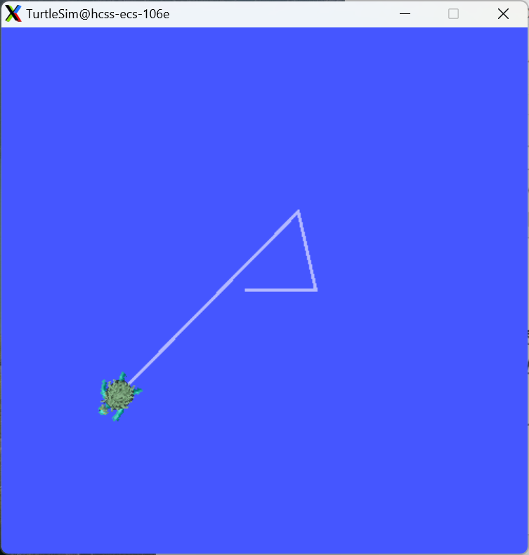  
为什么会在一个终端输入指令，另一个终端会做出反应呢？  
可以再打开一个终端，输入rqt，点击回车，会出现这样的界面
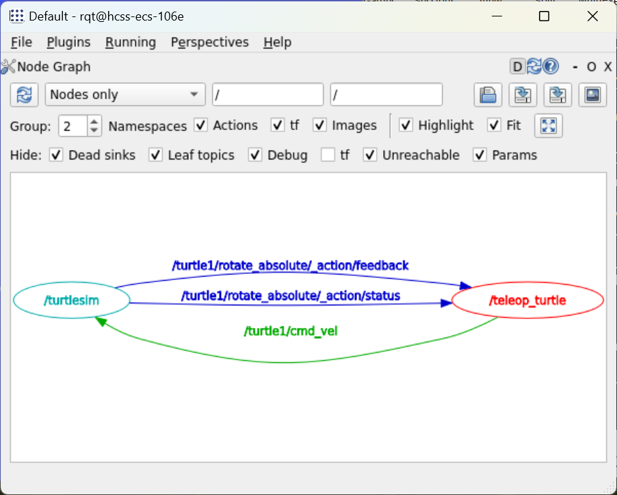
这里是两个节点，左边的节点表示小海龟模拟器的节点，右边的节点表示键盘的按键，看箭头可以发现右边节点向左边节点发送了一个topic提供数据，然后小海龟模拟器会做出一个反馈（响应）
# CMakeList编写示例
写一段CMakeLists的编写 默认情况下CMake会自动寻找系统中已安装的C++编译器
```CMakeLists
# cmake需要的最小版本
cmake_minimum_required(VERSION 3.8)
# 配置工程的名字
project(HelloWorld)
# 添加可执行文件 第一个参数是可执行文件的名字 第二个参数是cpp文件的名字
add_execuatable(learn_cmake hello_world.cpp)
```

再编写一段实现第一个节点cpp文件的CMakeLists
```CMakeList
cmake_minimum_required(VERSION 3.8)
project(ros2_cpp)
add_executable(ros2_cpp_node ros2_cpp_node.cpp)

# 查找rclcpp头文件和库文件的路径
find_package(rclcpp REQUIRED)
# 给可执行文件包含头文件
target_include_directories(ros2_cpp_node PUBLIC ${rclcpp_INCLUDE_DIRS})
# 给可执行文件链接库文件
target_link_libraries(ros2_cpp_node ${rclcpp_LIBRARIES})
```
查看正在运行节点列表
```bash
ros2 node list
```
查看具体节点的信息
```bash
ros2 node info /duan_node
```
# 使用功能包组织C++节点
ros2 pkg create 是ros2提供的用于创建功能包的命令  
demo_cpp_pkg 为要创建的功能包的名称(相当于是一个文件夹)  
--build-type ament_cmake 指定功能包的构建类型为ament_cmake  
在ros2中ament是构建系统，ament_cmake是基于CMake的构建方式  
--license Apache-2.0 指定功能包所采用的开源许可证为Apache-2.0  
这表明功能包代码遵循 Apache - 2.0 协议的相关规定，包括版权声明、许可使用条件等
```bash
ros2 pkg create demo_cpp_pkg --build-type ament_cmake --license Apache-2.0
```
通过上述命令创建功能包之后，会在功能包下面自动生成一个CMakeLists.txt文件，在编写完Cpp代码后，需要去里面手动修改一下，一般情况下添加如下代码并修改可执行文件的名称即可
```CMakeLists
find_package(rclcpp REQUIRED)
add_executable(cpp_node src/cpp_node.cpp)
# target_include_directories(cpp_node PUBLIC ${rclcpp_INCLUDE_DIRS})
# target_link_libraries(cpp_node ${rclcpp_LIBRARIES})
# 可以替换上述两行的方式  可以通过ament_cmake的构建方式进行简写
ament_target_dependencies(cpp_node rclcpp)
```
也可以在功能包(demo_cpp_pkg)上一级目录下，通过colcon去构建  
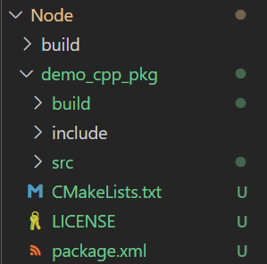
```bash
colcon build
```
colcon是ros2中推荐使用的构建工具，用于编译和管理工作空间中的多个功能包
tips：ldd可以查看某个可执行文件依赖哪些库
```bash
ldd cpp_node
```
在通过功能包实现节点之后，通过执行命令
```bash
ros2 run demo_cpp_pkg cpp_node
```
上述命令生成的可执行文件会在build目录下对应的功能包中
会发现出现问题 Package 'demo_cpp_pkg' not found  原因为：没有修改环境变量，需要执行下述命令通过脚本(export)帮我们修改环境变量
```bash
source install/setup.bash
```
再次执行会发现已经会报错 No executable found 是因为没有找到可执行文件 需要再去对应的CMakeLists.txt中添加如下代码 通过install命令 将可执行文件拷贝到install目录对应的功能包目录下
```CMakeList
install(TARGETS cpp_node
  DESTINATION lib/${PROJECT_NAME}
)
```
在使用功能包组织节点的时候，会自动生成一个package.xml文件，用于描述功能包的基本信息、依赖关系和构建要求，最好能进行一个声明
最后，一个功能包的完整结构如下：
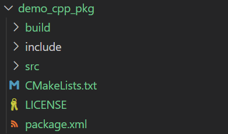
# WorkSpace
在工作空间下如果有多个功能包，但目前执行构建一个功能包，colcon会一次性全部构建完这个时候要怎么办呢？  
功能包构建产生的临时文件和功能包在同一目录下，此时如果想新增功能包就会很混乱，这个时候又要怎么办呢？  
所以接下来会介绍多功能包的最佳实践
一个完整的机器人项目往往由多个不同的功能模块组成，所以就需要对多个功能包进行组合  
ROS2开发者约定了Workspace--即工作空间这一概念  
首先创建双重目录 -p 递归创建
```bash
mkdir -p chapt2_ws/src
```
将之前的功能包拷贝到工作空间下
```bash
mv demo_cpp_pkg/ chapt2_ws/src/
```
删除之前的临时文件
```bash
rm -rf build/ install/ log/
```
然后就可以cd到chapt2_ws目录下 执行colcon build
```bash
cd chapt2_ws
colcon build
```
可以通过--help 以及 grep命令过滤查看colcon build都有什么使用方法
```bash
colcon build --help | grep select
```
只选用一个功能包
```bash
colcon build --packages-select demo_cpp_pkg
```
同时还可以在Workspace中决定功能包的构建顺序  
可以在python功能包的package.xml中加上<depend>demo_cpp_pkg</depend>
```xml
<depend>rclpy</depend>
<depend>demo_cpp_pkg</depend>
```
# 用得到的C++新特性
示例都在Cpp-YiFei文件夹下  
auto 自动类型推导  
make_shared 创建智能指针  
Lambda 匿名函数  
functional 函数包装器：在C++中有以下几种函数：  
1.自由函数（就是在外部封装一个函数，需要的时候去调用即可）
2.成员函数
3.Lambda函数  
通过函数包装器可以实现统一的调用方法  
多线程与回调函数示例  
这里以下载小说为例，线程1下载(第一章) 线程1统计数字(第一章内容)  
线程2下载(第二章) 线程2统计数字(第二章内容)  
线程3下载(第三章) 线程3统计数字(第三章内容)  
回调函数，回调回调，回头再调  
这里先去下载一个httplib，下载存放位置为Cpp-YiFei/include/
A C++11 single-file header-only cross platform HTTP/HTTPS library  
意思是说  单一头文件就支持HTTP/HTTPS跨平台，为了支持下载功能
```bash
git clone https://gitee.com/ohhuo/cpp-httplib.git
```
在对应的CMakeLists.txt中包含incluide目录，完整的CMakeList如下
```CMakeList
cmake_minimum_required(VERSION 3.8)
project(CppNew)

# 包含include头文件目录
include_directories(include)
add_executable(learn_auto learn_auto.cpp)
add_executable(learn_shared_ptr learn_shared_ptr.cpp)
add_executable(learn_lambda learn_lambda.cpp)
add_executable(learn_functional learn_functional.cpp)
add_executable(learn_thread learn_thread.cpp)
```
使用到了std::bind   std::thread
```C++
// 用法：第一个为可执行的函数(如果为类成员函数，需要再后面再传一个this指针)
// 后续的参数为占位符，代表需要用到几个参数，std::placeholder::_1,...
std::bind(callable, agr1, arg2, ...);
// callable为函数对象，后续的参数为该函数对象需要使用到的参数
std::thread(callable, arg1, arg2, ...);
// 避免线程阻塞，所以需要使用线程分离
thread::detach();
```
# 话题通信介绍
在话题通信这里会有四个关键点：发布者  订阅者  话题名称  话题类型  
举个例子--海龟模拟器话题  
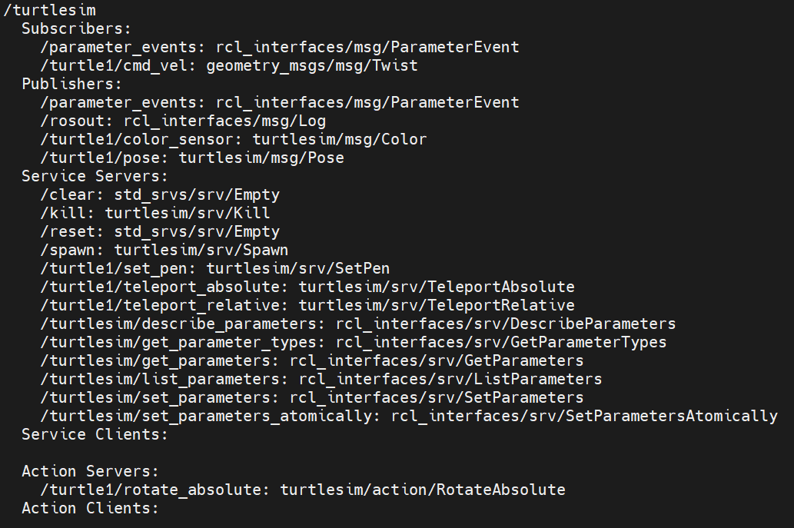  
可以看到对应的话题名称：话题类型  
这里是一些常用的命令，可以去看话题名称，话题类型，对应的数据内容等  
```bash
# 查看节点订阅了哪些topic 发布了哪些topic
ros2 run node info /turtlesim
# 查看某个话题的数据内容
ros2 topic echo /turtle1/pose
# 查看一个话题信息 包括消息类型、发布者数量、订阅者数量等等
ros2 topic info /turtle/cmd_vel -v
# 查看某个消息接口的定义
ros2 interface show geometry_msgs/msg/Twist
# 发布话题
ros2 topic pub /turtle1/cmd_vel geometry_msgs/msg/Twist "{linear: {x: 1.0}}"
```
```bash
# 启动小海龟
ros2 run turtlesim turtlesim_node
# 发布一个话题
ros2 topic pub /turtle1/cmd_vel geometry_msgs/msg/Twist "{linear: {x: 1.0}}"
# 小海龟订阅了这个话题，所以会执行相关的命令
```
效果如下：  
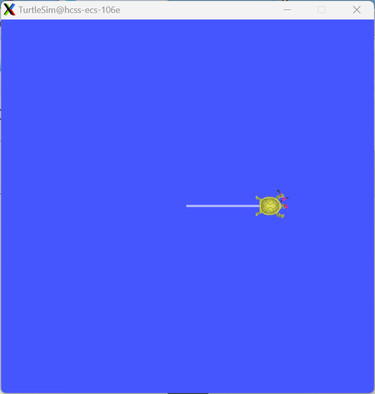  
接下来实现一个小demo，下载小说并通过话题间隔5s发布一行  
核心问题：  
问题1：怎么下载小说？request  
问题2：怎么发布？确定名字和接口  
问题3：怎么间隔5s发布？Timer定时器  
代码放在Topic文件夹下，首先创建一个工作空间  
```bash
mkdir -p topic_ws/src
# 在src下创建功能包
cd topic_ws/src/
# 添加依赖 & 添加证书
# 需要依赖rclcpp 因为发送的为string类型 这个接口类型在example_interfaces中
ros2 pkg create demo_cpp_topic --build-type ament_cmake --dependencies rclcpp example_interfaces --license Apache-2.0
# 然后回到topic_ws目录下
cd ..
# 执行colcon build 这样一个完整的工作目录就有了
colcon build
```
```bash
# 查看example_interfaces接口类型
ros2 interface list | grep example_interfaces
# 查看example_interfaces/msg/String接口内容
ros2 interface show example_interfaces/msg/String
```
启动http服务
```bash
# 在最外层的Topic目录下启动
# 小说也放在Topic目录下 novel novel1 novel2 novel3
python3 -m http.server
```
```C++
// 小说发布节点
#include <rclcpp/rclcpp.hpp>
#include <cpp-httplib/httplib.h>  // 下载相关的头文件
#include <std_msgs/msg/string.hpp>  // 消息接口的类型
#include <queue>

class NovelPubNode : public rclcpp::Node{
private:
    // 声明话题发布者指针
    rclcpp::Publisher<std_msgs::msg::String>::SharedPtr novel_publisher_;
    // 声明定时器指针
    rclcpp::TimerBase::SharedPtr timer_;
    // 创建一个队列，用来存放下载小说的每一行
    std::queue<std::string> mq_;
    void timer_callback(){
        std::string line;
        // 创建topic发送的消息对象
        std_msgs::msg::String message;
        if(mq_.size() > 0){
            // 发布消息
            line = mq_.front(); 
            mq_.pop();
            message.data = line;
            // 把message放入发布者中
            novel_publisher_->publish(message);
            RCLCPP_INFO(this->get_logger(), "发布了: '%s'", message.data.c_str());
        }
    }
public:
    NovelPubNode(const std::string& node_name) : Node(node_name){
        RCLCPP_INFO(this->get_logger(), "%s, 启动！", node_name.c_str());
        // 创建发布者
        novel_publisher_ = this->create_publisher<std_msgs::msg::String>("novel", 10);
        // 创建定时器，5s为周期，定时发布
        timer_ = this->create_wall_timer(std::chrono::milliseconds(5000), std::bind(&NovelPubNode::timer_callback, this));
    }

    // 从服务器上下载小说内容
    void download(const std::string& host, const std::string& path){
        httplib::Client client(host);
        auto response = client.Get(path);
        if(response && response->status == 200){
            std::string text = response->body;
            std::cout << "下载完成：" << path << ":" << "下载大小：" << text.size() << std::endl;
            // 按行分 放入队列
            std::istringstream iss(text);
            std::string line;
            while(std::getline(iss, line)){
                mq_.push(line);
            }
        }
    }
};

int main(int argc, char** argv){
    // 初始化rclcpp库
    rclcpp::init(argc, argv);
    // 创建节点实例
    auto node = std::make_shared<NovelPubNode>("novel_pub");
    // 下载小说
    node->download("http://0.0.0.0:8000", "/novel.txt");
    // 使节点进入自选状态，处理回调等
    rclcpp::spin(node);
    // 关闭rclcpp库
    rclcpp::shutdown(); 
    return 0;
}
```
对应的CMakeLists.txt
```CMakeLists
cmake_minimum_required(VERSION 3.8)
project(demo_cpp_topic)

if(CMAKE_COMPILER_IS_GNUCXX OR CMAKE_CXX_COMPILER_ID MATCHES "Clang")
  add_compile_options(-Wall -Wextra -Wpedantic)
endif()

# find dependencies
find_package(ament_cmake REQUIRED)
find_package(rclcpp REQUIRED)
include_directories(include/demo_cpp_topic)
find_package(std_msgs REQUIRED)
find_package(example_interfaces REQUIRED)


add_executable(novel_pub_node src/novel_pub_node.cc)
ament_target_dependencies(novel_pub_node rclcpp std_msgs)

install(TARGETS novel_pub_node
  DESTINATION lib/${PROJECT_NAME}
)

if(BUILD_TESTING)
  find_package(ament_lint_auto REQUIRED)
  # the following line skips the linter which checks for copyrights
  # comment the line when a copyright and license is added to all source files
  set(ament_cmake_copyright_FOUND TRUE)
  # the following line skips cpplint (only works in a git repo)
  # comment the line when this package is in a git repo and when
  # a copyright and license is added to all source files
  set(ament_cmake_cpplint_FOUND TRUE)
  ament_lint_auto_find_test_dependencies()
endif()

ament_package()
```
对应的package.xml
```xml
<?xml version="1.0"?>
<?xml-model href="http://download.ros.org/schema/package_format3.xsd" schematypens="http://www.w3.org/2001/XMLSchema"?>
<package format="3">
  <name>demo_cpp_topic</name>
  <version>0.0.0</version>
  <description>TODO: Package description</description>
  <maintainer email="15829054506@163.com">root</maintainer>
  <license>Apache-2.0</license>

  <buildtool_depend>ament_cmake</buildtool_depend>

  <depend>rclcpp</depend>
  <depend>example_interfaces</depend>
  <depend>std_msgs</depend>

  <test_depend>ament_lint_auto</test_depend>
  <test_depend>ament_lint_common</test_depend>

  <export>
    <build_type>ament_cmake</build_type>
  </export>
</package>
```
```bash
# 构建  在topic_ws目录下
colcon build
# 查看是否有这个topic的信息
ros2 topic list
# 查看topic发出的信息
ros2 topic echo /novel
```
基于上述的小demo继续开发  
订阅小说并逐行朗读  
核心问题：  
问题1：怎么订阅  
问题2：用什么来朗读文本？  Espeak  
问题3：小说来的快，读的太慢怎么办？队列  
这里的订阅节点使用python去编写，因为我想通过espeakng库让小说读起来
```bash
sudo apt install python3-pip -y
pip3 install espeakng
sudo apt install espeak-ng
```
我将订阅节点放在topic_2_ws/src/目录下  
```bash
ros2 pkg create demo_python_topic --build-type ament_python --dependencies rclpy example_interfaces --license Apache-2.0
# 接下来在Topic/topic_2_ws/src/demo_python_topic/ 创建novel_sub_node.py
```
```python
import espeakng
import rclpy
from rclpy.node import Node 
# from example_interfaces.msg import String
from std_msgs.msg import String
from queue import Queue
import threading
import time

class NovelSubNode(Node):
    def __init__(self, node_name):
        super().__init__(node_name)
        self.get_logger().info(f'{node_name}, 启动!')
        self.novels_queue_ = Queue()
        # 创建一个订阅者
        # 这里topic的名字  发布者 订阅者必须保持一致
        # 发布者只需要发布消息就可以了，订阅者必须要有回调，告诉自己有数据了
        self.novel_subscriber_ = self.create_subscription(String, "novel", self.novel_callback, 10)
        self.speech_thread_ = threading.Thread(target=self.speak_thread)
        # 线程启动 python里面的线程不会自己启动
        self.speech_thread_.start()
    
    # 这个message就是发布者发送的消息 ros2已经在内部帮我们处理好了  
    def novel_callback(self, message):
        self.novels_queue_.put(message.data)
        self.get_logger().info(f'收到消息: {message.data}')
        
    
    def speak_thread(self):
        # 生成一个对象
        speaker = espeakng.Speaker()
        # 设置一下属性 zh表示中文
        speaker.voice = 'zh'
        
        while rclpy.ok(): # 检测当前ros上下文是否ok
            if self.novels_queue_.qsize() > 0:
                text = self.novels_queue_.get()
                # 打印一下文字 不要一声不吭就朗读
                self.get_logger().info(f'朗读: {text}')
                speaker.say(text)
                # 说完才能说下一句
                speaker.wait()
            else:
                # 没数据的时候  要让当前线程休眠
                # 一直让线程while循环 和 适当休眠 对cpu的功耗是不一样的
                time.sleep(1)
        
def main():
    rclpy.init()
    node = NovelSubNode('novel_sub')
    rclpy.spin(node)
    rclpy.shutdown()
```
注意需要先运行服务器、再启动订阅节点、最后运行发布节点  
```bash
# 运行服务器
python3 -m http.server
# 分别在topic_ws 和 tpoic_2_ws目录下
# 在启动节点前 先source一下环境变量
source install/setup.bash
# 启动订阅节点
ros2 run demo_python_topic novel_sub_node
# 启动发布节点
ros2 run demo_cpp_topic novel_pub_node
```
再来一个需求：控制小海龟模拟器中的小海龟转指定半径的圆  
核心问题：  
1.小海龟凭什么听我的？ 话题  
2.前进后退我知道，画圆？线速度/角速度=半径 v = w * r  
3.发一下就停了，如何循环发？定时器  
首先需要启动一下小海龟的节点，并且查看有哪些topic  
```bash
# 启动节点
ros2 run turtlesim turtlesim_node
# 查看有哪些topic
ros2 topic list -t
# 在上述的topic中，我们会用到下面这几个 
# []里的是需要的头文件，后续在创建功能包的时候需要加在依赖里
# /turtle1/cmd_vel  [geometry_msgs/msg/Twist]
# /turtle1/color_sensor  [turtlesim/msg/Color]
# /turtle1/pose  [turtlesim/msg/Pose]
# 在topic_ws文件夹下创建功能包
ros2 pkg create demo_turtle_topic --build-type ament_cmake --dependencies rclcpp geometry_msgs turtlesim --license Apache-2.0
```
```C++
// 发布控制消息的节点
#include "rclcpp/rclcpp.hpp"
#include "geometry_msgs/msg/twist.hpp"  // 需要控制小海龟 所以需要这个头文件
#include <chrono>

using namespace std::chrono_literals;  // 对秒数进行自动转换

class TurtleCircleNode : public rclcpp::Node{
private:
    // 定时器  持续去发送信息
    rclcpp::TimerBase::SharedPtr timer_;
    // 模板类的智能指针   发布者的智能指针  后续需要赋值
    rclcpp::Publisher<geometry_msgs::msg::Twist>::SharedPtr publisher_;
public:
    // explicit关键字 强制要求显式调用构造函数进行对象初始化
    explicit TurtleCircleNode(const std::string& node_name) : Node(node_name){
        publisher_ = this->create_publisher<geometry_msgs::msg::Twist>("/turtle/cmd_vel", 10);
        // 我这里采用匿名函数作为回调函数
        timer_ = this->create_wall_timer(1000ms, [&](){
            // 创建消息
            auto msg = geometry_msgs::msg::Twist();
            // 设置消息内容 线速度
            msg.linear.x = 1.0;
            msg.linear.z = 0.5;
            // 发布消息
            publisher_->publish(msg);
        });
    }
};

int main(int argc, char** argv){
    rclcpp::init(argc, argv);
    auto node = std::make_shared<TurtleCircleNode>("turtle_circle");
    // 运行节点
    rclcpp::spin(node);
    rclcpp::shutdown();
    return 0;
}
```
```bash
colcon build
source install/setup.bash
ros2 run demo_turtle_topic turtle_circle
# 再开启一个终端 查看节点 topic 以及topic内容
ros2 node list
ros2 node info /turtle_circle
# 查看发布内容
ros2 topic echo /turtle1/cmd_vel
# 再次运行小海龟 发现小海龟会画圆
ros2 run turtlesim turtlesim_node
```
功能展示：  
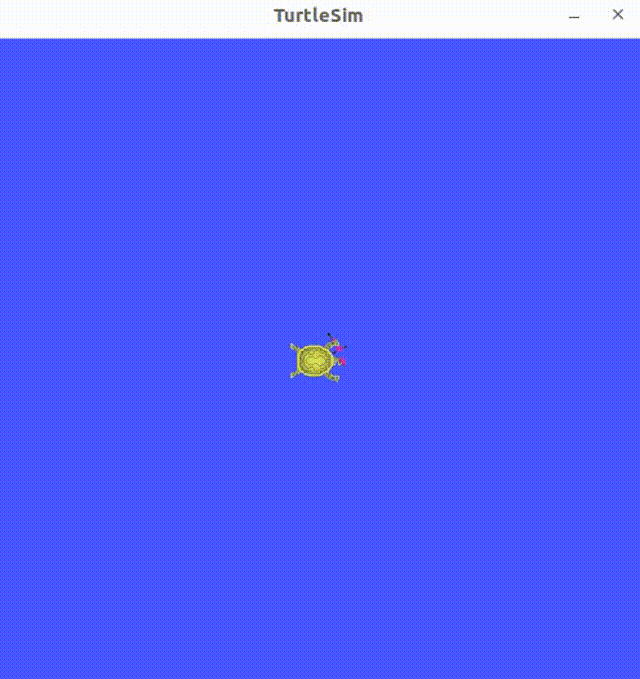  
订阅pose实现闭环控制  
需求：告诉小海龟到指定位置，自己滚过去  
核心问题：  
1.小海龟凭什么听我的  
2.小海龟现在在哪里？订阅话题  
3.怎么根据当前位置和目标位置计算角速度和线速度？两点之间距离->线速度 当前朝向和目标朝向差->角速度  
小海龟实时位置在/turtle1/pose这个topic下  
这里的逻辑是：订阅节点获取小海龟的位置，做一个处理，得到控制信息(线速度，角度) 通过发布节点将控制消息发送出去，小海龟会有对应的行动  
```C++
#include "rclcpp/rclcpp.hpp"
#include "geometry_msgs/msg/twist.hpp"  // 需要控制小海龟 所以需要这个头文件
#include <chrono>
#include "turtlesim/msg/pose.hpp"

using namespace std::chrono_literals;  // 对秒数进行自动转换

class TurtleControlNode : public rclcpp::Node{
private:
    // 模板类的智能指针   发布者的智能指针  后续需要赋值
    rclcpp::Publisher<geometry_msgs::msg::Twist>::SharedPtr publisher_;
    // 同理 订阅者
    rclcpp::Subscription<turtlesim::msg::Pose>::SharedPtr subscriber_;
    // 目标位置 C++11 引入统一初始化方式{}
    double target_x_{1.0};
    double target_y_{1.0};
    // 比例系数
    double k_{1.0};
    // 最大速度  限制速度大小
    double max_speed_{3.0};
public:
    // explicit关键字 强制要求显式调用构造函数进行对象初始化
    explicit TurtleControlNode(const std::string& node_name) : Node(node_name){
        publisher_ = this->create_publisher<geometry_msgs::msg::Twist>("/turtle1/cmd_vel", 10);
        // 订阅别人的话题 所以名字必须是这个话题的名字
        // 回调函数的参数就是收到的数据 参数：收到数据的共享指针
        // 如果非要写成类成员函数 就需要通过std::bind 转为函数对象
        subscriber_ = this->create_subscription<turtlesim::msg::Pose>("/turtle1/pose", 10, [&](const turtlesim::msg::Pose::SharedPtr pose){
            // TODO 
            // 根据当前位置 和 目标位置  计算出新的线速度和角速度
            // 终端下 可以通过ros2 interface show turtlesim/msg/Pose 查看接口定义
            // 1.获取当前的位置
            auto cur_x = pose->x;
            auto cur_y = pose->y;
            RCLCPP_INFO(get_logger(), "当前: x=%f,y=%f", cur_x, cur_y);
            // 2.计算当前小海龟位置跟目标位置之间的距离差和角度差
            auto distance = std::sqrt(
                (target_x_ - cur_x) * (target_x_ - cur_x) + 
                (target_y_ - cur_y) * (target_y_ - cur_y)
            );
            // atan2 = arctan  可以求出角度
            // 计算角度差
            auto angle = std::atan2((target_y_ - cur_y), (target_x_ - cur_x)) - pose->theta;
            // 3.控制策略
            auto msg = geometry_msgs::msg::Twist();

            // 距离 > 0.1  角度差 > 0.2 才作出控制 否则直接向前就好了
            if(distance > 0.1){
                if(fabs(angle) > 0.2){
                    // 角度差太大了 需要原地转一下
                    msg.angular.z = fabs(angle);
                }
                else{
                    // 否则直接走
                    msg.linear.x = k_ * distance;
                }
            }

            // 限制线速度最大值
            if(msg.linear.x > max_speed_){
                msg.linear.x = max_speed_;
            }
            
            // 再把控制的消息发布出去
            // 这里相当于订阅节点用来获取位置，发布节点通过计算 将控制消息发布出去
            publisher_->publish(msg);
        });
    }
};

int main(int argc, char** argv){
    rclcpp::init(argc, argv);
    auto node = std::make_shared<TurtleControlNode>("turtle_control");
    // 运行节点
    rclcpp::spin(node);
    rclcpp::shutdown();
    return 0;
}
```
功能展示：  
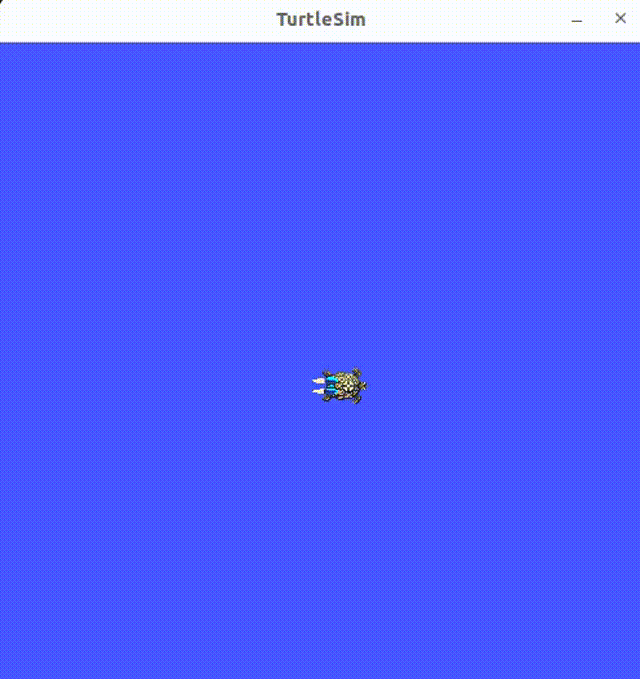  
实战项目：  
需求：  
第一，通过这个小工具可以看到系统的实时状态信息包括记录信息的时间、主机名称、CPU使用率、内存
使用率、内存总大小、剩余内存、网络接收数据量和网络发送数据量； 
第二，要有一个简单的界面，可以将系统信息显示出来；  
第三，要能在局域网内其他主机上查看数据  
分析：  
第一，要能获取系统状态信息，Python库osutils  
第二，要有一个展示界面，Qt  
第三，要能共享数据，ROS2话题  
用python编写系统状态信息，C++编写展示界面  
在写这个项目之前，先了解学习一下自定义通信接口  
```bash
# 新建一个工作空间
mkdir -p topic_practice_ws/src
# 创建功能包 接口的定义也会放在功能包下 但是首先要做一些配置
# status_interfaces 功能包名称
# --build-type ament_cmake 构建类型
# --dependencies builtin_interfaces rosidl_default_generators 依赖项
# builtin_interfaces 为ros2接口提供基础类型定义，如时间戳、持续时间等都包含在内
# rosidl_default_generators 用于生成ros2接口代码，若要自定义.msg 或 .srv文件
# 就需要依赖此功能包 .msg文件：用于定义消息类型 .srv文件：用于定义服务类型
ros2 pkg create status_interfaces --build-type ament_cmake --dependencies builtin_interfaces rosidl_default_generators --license Apache-2.0
# 在status_interfaces目录下创建一个文件夹 文件夹名字是固定的 msg
mkdir msg
touch SystemStatus.msg
# 可以去文件中定义消息类型了
```
```SystemStatus
# .msg文件内容如下
builtin_interfaces/Time stamp # 记录时间戳
string host_name # 主机名字
float32 cpu_percent # CPU使用率
float32 memory_percent # 内存使用率
float32 memory_total # 内存总大小
float32 memory_available # 内存可用量
float64 net_sent # 网络发送数据总量 1MB=8Mb
float64 net_recv # 网络数据接收总量 MB
```
需要在CMakeLists.txt package.XML中配置一下 才能生成接口代码
```CMakeLists
# cmake中的函数，来自依赖rosidl_default_generators，用于将msg等消息接口定义文件转换成库或者头文件类
rosidl_generate_interfaces(${PROJECT_NAME}
  "msg/SystemStatus.msg"
  DEPENDENCIES builtin_interfaces
)
```
```XML
<member_of_group>rosidl_interface_packages</member_of_group>
```
CMakeLists中的rosidl_generator_interfaces函数会帮我们生成接口代码  
生存的代码和动态库在install文件夹下  
查看消息接口的具体信息  
```bash
source install/setup.bash
ros2 interface show status_interfaces/msg/SystemStatus
```
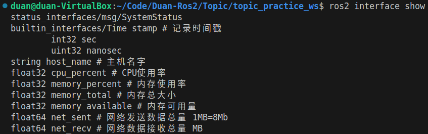  
获取系统信息可以使用python中的库，所以这里使用python来编写发布信息的节点  
发布信息的类型就是我们刚才自定义的消息接口  
```bash
# 创建功能包
# 发布节点 status_interfaces是刚才自定义的消息接口 这里需要作为依赖
ros2 pkg create status_publisher --build-type ament_python --dependencies rclpy status_interfaces --license Apache-2.0
```
```python
import rclpy
from status_interfaces.msg import SystemStatus
from rclpy.node import Node 
import psutil
import platform

class SysStatusPub(Node):
    def __init__(self, node_name):
        super().__init__(node_name)
        self.status_publisher_ = self.create_publisher(
            SystemStatus, 'sys_status', 10
        )
        self.timer = self.create_timer(1.0, self.timer_callback)

    def timer_callback(self):
        """
        builtin_interfaces/Time stamp # 记录时间戳
        string host_name # 主机名字
        float32 cpu_percent # CPU使用率
        float32 memory_percent # 内存使用率
        float32 memory_total # 内存总大小
        float32 memory_available # 内存可用量
        float64 net_sent # 网络发送数据总量 1MB=8Mb
        float64 net_recv # 网络数据接收总量 MB
        """
        # 从库中获取
        cpu_percent = psutil.cpu_percent()
        memory_info = psutil.virtual_memory()
        net_io_counters = psutil.net_io_counters()

        # 组装消息
        msg = SystemStatus()
        msg.stamp = self.get_clock().now().to_msg()
        msg.host_name = platform.node()
        msg.cpu_percent = cpu_percent
        msg.memory_percent = memory_info.percent 
        msg.memory_total = memory_info.total / 1024 / 1024
        msg.memory_available = memory_info.available /1024 / 1024
        msg.net_sent = net_io_counters.bytes_sent / 1024 / 1024
        msg.net_recv = net_io_counters.bytes_recv / 1024 / 1024

        self.get_logger().info(f'发布：{str(msg)}')
        self.status_publisher_.publish(msg)

def main():
    rclpy.init()
    node = SysStatusPub('sys_status_pub')
    rclpy.spin(node)
    rclpy.shutdown()
```
```bash
colcon build
source install/setup.bash
ros2 run status_publisher sys_status_pub
```
Qt是跨平台的可视化工具  
```bash
ros2 pkg create status_display --build-type ament_cmake --dependencies rclcpp status_interfaces --license Apache-2.0
```
```C++
#include <QApplication>
#include <QLabel>
#include <QString>

int main(int argc, char** argv){
    QApplication app(argc, argv);
    QLabel* label = new QLabel();
    QString message = QString::fromStdString("Hello Qt!");
    // 将文本放入label
    label->setText(message);
    // 此时label可以展示了 但是要通过app去调用
    label->show();
    // 执行应用  不断循环，阻塞代码
    app.exec();
    return 0;
}
```
```bash
colcon build
source install/setup.bash
ros2 run status_display hello_qt5
```
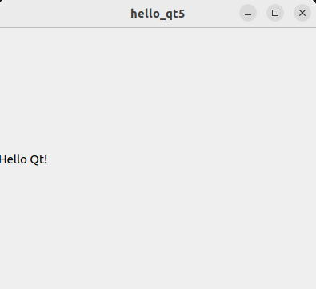  
订阅数据并用Qt显示  
注意C++代码使用到了智能指针，以及线程使用的巧妙之处  
```C++
#include <QApplication>
#include <QLabel>
#include <QString>
#include <rclcpp/rclcpp.hpp>
#include <status_interfaces/msg/system_status.hpp>  // 自定义消息接口

using SystemStatus = status_interfaces::msg::SystemStatus;

class SysStatusDisplay : public rclcpp::Node{
private:
    rclcpp::Subscription<SystemStatus>::SharedPtr subscriber_;
    std::shared_ptr<QLabel> label_;
public:
    SysStatusDisplay() : Node("sys_status_display"){
        label_ = std::make_shared<QLabel>();
        // topic要和发布者保持一致 不然接收不到消息
        subscriber_ = this->create_subscription<SystemStatus>("sys_status", 10, [&](const SystemStatus::SharedPtr msg) -> void {
            label_->setText(get_qstr_from_msg(msg));
        });
        label_->setText(get_qstr_from_msg(
            std::make_shared<SystemStatus>()
        ));
        label_->show();
    }

    // # 组装消息
    //     msg = SystemStatus()
    //     msg.stamp = self.get_clock().now().to_msg()
    //     msg.host_name = platform.node()
    //     msg.cpu_percent = cpu_percent
    //     msg.memory_percent = memory_info.percent 
    //     msg.memory_total = memory_info.total / 1024 / 1024
    //     msg.memory_available = memory_info.available /1024 / 1024
    //     msg.net_sent = net_io_counters.bytes_sent / 1024 / 1024
    //     msg.net_recv = net_io_counters.bytes_recv / 1024 / 1024

    QString get_qstr_from_msg(const SystemStatus::SharedPtr msg){
        std::stringstream show_str;
        // 先输入一行进去    /t 让不同字段间保持统一的缩进  %表示普通字符 无特殊格式意义
        show_str << "=========端======状态可视化显示工具======菲～=========\n" << 
        "数 据 时 间:\t" << msg->stamp.sec << "\ts\n" << 
        "主 机 名 字:\t" << msg->host_name << "\t\n" <<
        "CPU 使用率:\t" << msg->cpu_percent << "\t%\n" <<
        "内存使用率:\t" << msg->memory_percent << "\t%\n" <<
        "内存总大小:\t" << msg->memory_total << "\tMB\n" <<
        "剩余有效内存:\t" << msg->memory_available << "\tMB\n" <<
        "网络发送量:\t" << msg->net_sent << "\tMB\n" <<
        "网络发送量:\t" << msg->net_recv << "\tMB\n"
        << "===========================================";
        return QString::fromStdString(show_str.str());
    }
};

int main(int argc, char** argv){
    rclcpp::init(argc, argv);
    QApplication app(argc, argv);
    // 这里不可以这样写 因为无论是spin放在前面  还是exec放在前面 都会将代码阻塞 达不到预期效果
    /* auto node = std::make_shared<SysStatusDisplay>();
    rclcpp::spin(node);
    // 执行应用  不断循环，阻塞代码
    app.exec(); */
    auto node = std::make_shared<SysStatusDisplay>();
    // 这里采用多线程去执行
    std::thread spin_thread([&]() -> void {
                            {
                                rclcpp::spin(node);
                            }
    });
    // 防止线程在上面等待执行  阻塞   应该使用detach
    spin_thread.detach();
    // 这里Qt就可以正常显示出来了
    app.exec();
    rclcpp::shutdown();
    return 0;
}
```
```bash
colcon build
source install/setup.bash
# 开启订阅节点
ros2 run status_display sys_status_display
# 再打开一个终端
source install/setup.bash
# 开启发布节点
ros2 run status_publisher sys_status_pub
```
效果展示:  
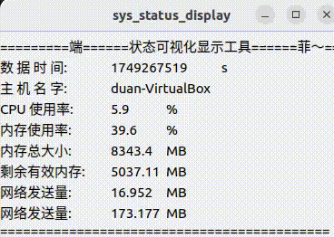
# 服务通信介绍 
服务是双向通信，是有结果的话题
```bash
# 在小海龟模拟器中再产生一个小海龟
ros2 run turtlesim turtlesim_node
# 展示一下都有什么服务
ros2 run service list -t
# 查看turtlesim/srv/Spawn接口都有什么参数
ros2 interface show turtlesim/srv/Spawn
# service call 请求服务
# /spawn 服务名字
# turtlesim/srv/Spawn "{x: 1, y: 1}消息接口和具体参数
ros2 service call /spawn turtlesim/srv/Spawn "{x: 1, y: 1}"
# 会得到一个响应
```
效果展示：  
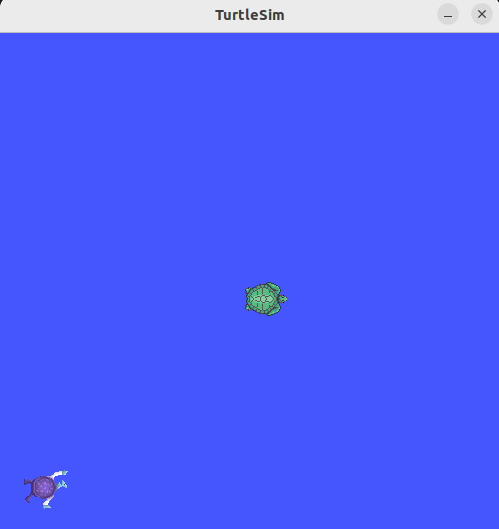  
基于服务的参数通信  
参数被视为节点的设置，是基于服务通信实现的  
```bash
# 查看都有哪些带参数的服务
ros2 service list -t | grep parameter
# 查看具体都有哪些参数
ros2 param list
# 查看参数的描述
ros2 param describe /turtlesim background_r
# 查看某个具体参数的值
ros2 param get /turtlesim background_r
```
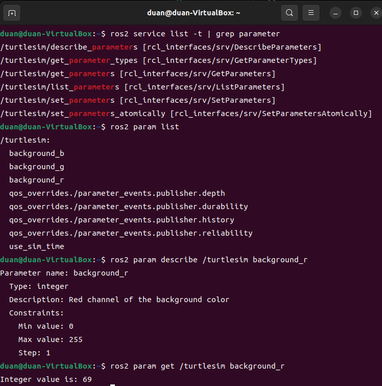  
修改参数的值  
```bash
# 修改参数的值
ros2 param set /turtlesim background_r 255
```
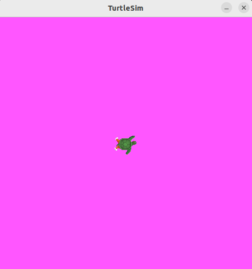  
把参数信息输出到一个文件中  
```bash
# 因为是信息yaml格式 所以输出到yaml文件中
ros2 param dump /turtlesim > turtle_param.yaml
# 后续可以直接调用yaml文件去开启小海龟
# --ros-args --param-file会用给argc argv
ros2 run turtlesim turtlesim_node --ros-args --param-file turtle_param.yaml
# 可以查看有什么方法  使用rqt也可以通过图形化界面去修改参数
ros2 param --help
```
接下来在程序中使用服务和参数进行通信  
Python服务通信，实现人脸检测  
需求：创建一个人脸检测服务，提供图像，返回人脸数量位置信息  
难点分析：  
1.人脸怎么识别？face_recognition  
2.图片数据和结果怎么传递？服务通信就很合适  
3.没有合适的消息接口？自定义一个  
自定义服务接口  
```bash
sensor_msgs/Image image  # 原始图像
---
int16 number  # 人脸个数
float32 use_time  # 识别耗时
int32[] top # ；人脸在图像中位置
int32[] right
int32[] bottom
int32[] left
```
```bash
mkdir Service
mkdir -p service_ws/src
ros2 pkg create ser_interfaces --build-type ament_cmake --dependencies sensor_msgs rosidl_default_generators --license Apache-2.0
```
```bash
colcon build
source install/setup.bash
# 生成的库就在install目录下
# 检测一下
ros2 interface show ser_interfaces/srv/FaceDetector
```
Python人脸检测
```bash
# 安装人脸识别库
pip3 install face_recognition -i https://pypi.tuna.tsinghua.edu.cn/simple
ros2 pkg create demo_python_service --build-type ament_python --dependencies rclpy ser_interfaces --license Apache-2.0
# 示例图片在resource目录下
```
```python
import face_recognition
import cv2
from ament_index_python.packages import get_package_share_directory # 获取 ROS2 功能包的共享目录路径
import os

def main():
    # 获取图片真实路径
    default_image_path = os.path.join(get_package_share_directory('demo_python_service'), 'resource/default.jpg')
    print(f"图片真实路径:{default_image_path}")
    # 使用cv2来加载图片
    image = cv2.imread(default_image_path)
    # 检测人脸
    face_locations = face_recognition.face_locations(image, number_of_times_to_upsample=1, model='hog')
    # 绘制人脸框
    for top, right, bottom, left in face_locations:
        # 给左上角 右下角  框框颜色  宽度
        cv2.rectangle(image, (left, top), (right, bottom), (0, 255, 0), 4)
    
    # 保持宽高比，根据屏幕大小自动计算合适的尺寸
    max_width = 800
    max_height = 600
    # 计算宽高比
    height, width = image.shape[:2]
    ratio = min(max_width/width, max_height/height)
    # 计算新尺寸
    new_width = int(width * ratio)
    new_height = int(height * ratio)
    dim = (new_width, new_height)
    # 执行缩放
    image = cv2.resize(image, dim, interpolation=cv2.INTER_AREA)

    # 结果显示
    cv2.imshow('Face Detect Result', image)
    cv2.waitKey(0)
```
效果展示：  
  
上述只是一个人脸识别的小示例，接下来继续学习使用服务和参数进行通信  
两种图片格式  ROS  OPENCV 
```bash
ROS  <===  CV BRIDGE  ===> OPENCV
```
服务实现步骤： 
创建服务，接收请求Request  
调用face_recognition识别  
处理识别结果合成Response返回  
```python
import rclpy
from rclpy.node import Node
from ser_interfaces.srv import FaceDetector
import face_recognition
import cv2
from ament_index_python.packages import get_package_share_directory # 获取 ROS2 功能包的共享目录路径
import os
from cv_bridge import CvBridge  # 转图像格式的库
import time

class FaceDetectNode(Node):
    def __init__(self):
        super().__init__('face_detect_node')
        self.service_ = self.create_service(FaceDetector, 'face_detect', self.detect_face_callback)
        self.bridge = CvBridge()
        self.number_of_times_to_upsample = 1 
        self.model = 'hog'
        self.default_image_path = os.path.join(get_package_share_directory
        ('demo_python_service'), 'resource/default.jpg')
        self.get_logger().info("人脸检测服务已经启动!")

    def detect_face_callback(self, request, response):
        # 考虑程序的健壮性 if else一下
        if request.image.data:
            cv_image = self.bridge.imgmsg_to_cv2(request.image)
        else:
            cv_image = cv2.imread(self.default_image_path)
            self.get_logger().info(f"传入图像为空，使用默认图像！")
        # cv_image已经是一个opencv格式的图像了
        start_time = time.time()
        self.get_logger().info(f"加载完图像，开始识别！")
        face_locations = face_recognition.face_locations(cv_image, 
            number_of_times_to_upsample=self.number_of_times_to_upsample, model=self.model)
        response.use_time = time.time() - start_time
        response.number = len(face_locations)

        for top, right, bottom, left in face_locations:
            response.top.append(right)
            response.right.append(right)
            response.bottom.append(bottom)
            response.left.append(left)

        return response  # 必须返回response

def main():
    rclpy.init()
    node = FaceDetectNode()
    rclpy.spin(node)
    rclpy.shutdown()
```
```bash
# 检测服务有没有启动
colcon build
source install/setup.bash
ros2 run demo_python_service face_detect_node
# 再开启一个终端
ros2 service list -t
```
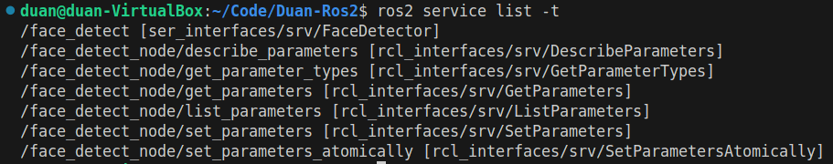  
客户端实现步骤：  
创建服务客户端  
构造Request，发送请求  
处理返回的Response，绘制人脸显示  
```python
import rclpy
from rclpy.node import Node
from ser_interfaces.srv import FaceDetector
import face_recognition
import cv2
from ament_index_python.packages import get_package_share_directory # 获取 ROS2 功能包的共享目录路径
import os
from cv_bridge import CvBridge  # 转图像格式的库
import time

class FaceDetectClientNode(Node):
    def __init__(self):
        super().__init__('face_detect_client_node')
        self.bridge = CvBridge()
        self.default_image_path = os.path.join(get_package_share_directory
        ('demo_python_service'), 'resource/test1.jpg')
        self.get_logger().info("人脸检测客户端已经启动!")
        self.client = self.create_client(FaceDetector, 'face_detect')
        self.image = cv2.imread(self.default_image_path)

    def send_request(self):
        # 1.判断服务端是否在线 这个服务有没有上线
        # 等待超时时间
        while self.client.wait_for_service(timeout_sec=1.0) is False:
            self.get_logger().info('等待服务端上线')
        # 2.构造Request
        request = FaceDetector.Request()
        request.image = self.bridge.cv2_to_imgmsg(self.image)
        # 3.发送请求并等待处理完成
        # 创建服务请求并异步获取结果
        # 现在future中并没有包含response result  所以这个单词也有未来的意思
        # 需要等待服务端处理完成才会把结果放在future中
        future = self.client.call_async(request)
        # # 目前程序是单线程，所以程序会死睡在这里
        # # 造成当前线程无法再来接收来自服务端的返回
        # # 导致永远无法完成
        # while not future.done():
        #     time.sleep(1.0)  # 休眠当前线程

        # ros2对这个问题有处理
        # 在后台边去接收结果  边去等待
        # rclpy.spin_until_future_complete(self, future)  # 等待服务端返回响应
        # 另一种写法 防止spin阻塞
        def result_callback(result_future):
            response = future.result() # 获取响应
            self.get_logger().info(f'接收到响应，共检测到有{response.number}张人脸，耗时{response.use_time}s')
            self.show_response(response)

        future.add_done_callback(
            result_callback
        )

    def show_response(self, response):
        for i in range(response.number):
            top = response.top[i]
            right = response.right[i]
            bottom = response.bottom[i]
            left = response.left[i]
            cv2.rectangle(self.image, (left, top), (right, bottom), (0, 255, 0), 4)
        cv2.imshow('Face Detect Result', self.image)
        cv2.waitKey(0) # 也是阻塞的 会导致spin无法正常运行
        # 但是这里是只发送一次请求，所以不影响 最终卡在这里也没关系
        # 但是在以后的代码中，如果需要发送多次请求，就需要注意一下

def main():
    rclpy.init()
    node = FaceDetectClientNode()
    node.send_request()
    rclpy.spin(node)
    rclpy.shutdown()
```