# 目录介绍
Image文件夹存放的是后续在讲解中会用到的图片  
Node文件夹用来存放学习基础知识时编写的代码  
Topic文件夹是在学习topic通信时编写的代码  
Service文件夹是在学习服务通信时编写的代码  
TF-tools文件夹是在学习坐标变换时编写的代码  
Simulation文件夹是学习仿真时编写的代码  
duan-src是存放项目代码的文件夹  
Cpp-YiFei存放C++新特性示例代码  
Video文件夹用于存放展示的视频  
rosbag2_xxx是录包产生的文件  
# 运行小海龟
我们学习每个编程语言的时候，第一次学都是会去打印hello world  
同理，学习ros2的时候会去打印小海龟

在终端中运行
ros2是安装好ros2后会提供的命令
run是运行
turtlesim是功能包的名字
turtlesim_node是可执行文件的名字
```bash
ros2 run turtlesim turtlesim_node
``` 
使用键盘控制小海龟
```bash
ros2 run turtlesim turtle_teleop_key
```
tips:不是通过点击小海龟界面来使它移动
再打开一个终端，运行另一个可执行程序
在新打开的终端输入键盘按键来控制，相当于是两个节点进行通信
效果：
  
为什么会在一个终端输入指令，另一个终端会做出反应呢？  
可以再打开一个终端，输入rqt，点击回车，会出现这样的界面

这里是两个节点，左边的节点表示小海龟模拟器的节点，右边的节点表示键盘的按键，看箭头可以发现右边节点向左边节点发送了一个topic提供数据，然后小海龟模拟器会做出一个反馈（响应）
# CMakeList编写示例
写一段CMakeLists的编写 默认情况下CMake会自动寻找系统中已安装的C++编译器
```CMakeLists
# cmake需要的最小版本
cmake_minimum_required(VERSION 3.8)
# 配置工程的名字
project(HelloWorld)
# 添加可执行文件 第一个参数是可执行文件的名字 第二个参数是cpp文件的名字
add_execuatable(learn_cmake hello_world.cpp)
```

再编写一段实现第一个节点cpp文件的CMakeLists
```CMakeList
cmake_minimum_required(VERSION 3.8)
project(ros2_cpp)
add_executable(ros2_cpp_node ros2_cpp_node.cpp)

# 查找rclcpp头文件和库文件的路径
find_package(rclcpp REQUIRED)
# 给可执行文件包含头文件
target_include_directories(ros2_cpp_node PUBLIC ${rclcpp_INCLUDE_DIRS})
# 给可执行文件链接库文件
target_link_libraries(ros2_cpp_node ${rclcpp_LIBRARIES})
```
查看正在运行节点列表
```bash
ros2 node list
```
查看具体节点的信息
```bash
ros2 node info /duan_node
```
# 使用功能包组织C++节点
ros2 pkg create 是ros2提供的用于创建功能包的命令  
demo_cpp_pkg 为要创建的功能包的名称(相当于是一个文件夹)  
--build-type ament_cmake 指定功能包的构建类型为ament_cmake  
在ros2中ament是构建系统，ament_cmake是基于CMake的构建方式  
--license Apache-2.0 指定功能包所采用的开源许可证为Apache-2.0  
这表明功能包代码遵循 Apache - 2.0 协议的相关规定，包括版权声明、许可使用条件等
```bash
ros2 pkg create demo_cpp_pkg --build-type ament_cmake --license Apache-2.0
```
通过上述命令创建功能包之后，会在功能包下面自动生成一个CMakeLists.txt文件，在编写完Cpp代码后，需要去里面手动修改一下，一般情况下添加如下代码并修改可执行文件的名称即可
```CMakeLists
find_package(rclcpp REQUIRED)
add_executable(cpp_node src/cpp_node.cpp)
# target_include_directories(cpp_node PUBLIC ${rclcpp_INCLUDE_DIRS})
# target_link_libraries(cpp_node ${rclcpp_LIBRARIES})
# 可以替换上述两行的方式  可以通过ament_cmake的构建方式进行简写
ament_target_dependencies(cpp_node rclcpp)
```
也可以在功能包(demo_cpp_pkg)上一级目录下，通过colcon去构建  

```bash
colcon build
```
colcon是ros2中推荐使用的构建工具，用于编译和管理工作空间中的多个功能包
tips：ldd可以查看某个可执行文件依赖哪些库
```bash
ldd cpp_node
```
在通过功能包实现节点之后，通过执行命令
```bash
ros2 run demo_cpp_pkg cpp_node
```
上述命令生成的可执行文件会在build目录下对应的功能包中
会发现出现问题 Package 'demo_cpp_pkg' not found  原因为：没有修改环境变量，需要执行下述命令通过脚本(export)帮我们修改环境变量
```bash
source install/setup.bash
```
再次执行会发现已经会报错 No executable found 是因为没有找到可执行文件 需要再去对应的CMakeLists.txt中添加如下代码 通过install命令 将可执行文件拷贝到install目录对应的功能包目录下
```CMakeList
install(TARGETS cpp_node
  DESTINATION lib/${PROJECT_NAME}
)
```
在使用功能包组织节点的时候，会自动生成一个package.xml文件，用于描述功能包的基本信息、依赖关系和构建要求，最好能进行一个声明
最后，一个功能包的完整结构如下：

# WorkSpace
在工作空间下如果有多个功能包，但目前执行构建一个功能包，colcon会一次性全部构建完这个时候要怎么办呢？  
功能包构建产生的临时文件和功能包在同一目录下，此时如果想新增功能包就会很混乱，这个时候又要怎么办呢？  
所以接下来会介绍多功能包的最佳实践
一个完整的机器人项目往往由多个不同的功能模块组成，所以就需要对多个功能包进行组合  
ROS2开发者约定了Workspace--即工作空间这一概念  
首先创建双重目录 -p 递归创建
```bash
mkdir -p chapt2_ws/src
```
将之前的功能包拷贝到工作空间下
```bash
mv demo_cpp_pkg/ chapt2_ws/src/
```
删除之前的临时文件
```bash
rm -rf build/ install/ log/
```
然后就可以cd到chapt2_ws目录下 执行colcon build
```bash
cd chapt2_ws
colcon build
```
可以通过--help 以及 grep命令过滤查看colcon build都有什么使用方法
```bash
colcon build --help | grep select
```
只选用一个功能包
```bash
colcon build --packages-select demo_cpp_pkg
```
同时还可以在Workspace中决定功能包的构建顺序  
可以在python功能包的package.xml中加上<depend>demo_cpp_pkg</depend>
```xml
<depend>rclpy</depend>
<depend>demo_cpp_pkg</depend>
```
# 用得到的C++新特性
示例都在Cpp-YiFei文件夹下  
auto 自动类型推导  
make_shared 创建智能指针  
Lambda 匿名函数  
functional 函数包装器：在C++中有以下几种函数：  
1.自由函数（就是在外部封装一个函数，需要的时候去调用即可）
2.成员函数
3.Lambda函数  
通过函数包装器可以实现统一的调用方法  
多线程与回调函数示例  
这里以下载小说为例，线程1下载(第一章) 线程1统计数字(第一章内容)  
线程2下载(第二章) 线程2统计数字(第二章内容)  
线程3下载(第三章) 线程3统计数字(第三章内容)  
回调函数，回调回调，回头再调  
这里先去下载一个httplib，下载存放位置为Cpp-YiFei/include/
A C++11 single-file header-only cross platform HTTP/HTTPS library  
意思是说  单一头文件就支持HTTP/HTTPS跨平台，为了支持下载功能
```bash
git clone https://gitee.com/ohhuo/cpp-httplib.git
```
在对应的CMakeLists.txt中包含incluide目录，完整的CMakeList如下
```CMakeList
cmake_minimum_required(VERSION 3.8)
project(CppNew)

# 包含include头文件目录
include_directories(include)
add_executable(learn_auto learn_auto.cpp)
add_executable(learn_shared_ptr learn_shared_ptr.cpp)
add_executable(learn_lambda learn_lambda.cpp)
add_executable(learn_functional learn_functional.cpp)
add_executable(learn_thread learn_thread.cpp)
```
使用到了std::bind   std::thread
```C++
// 用法：第一个为可执行的函数(如果为类成员函数，需要再后面再传一个this指针)
// 后续的参数为占位符，代表需要用到几个参数，std::placeholder::_1,...
std::bind(callable, agr1, arg2, ...);
// callable为函数对象，后续的参数为该函数对象需要使用到的参数
std::thread(callable, arg1, arg2, ...);
// 避免线程阻塞，所以需要使用线程分离
thread::detach();
```
# 话题通信介绍
在话题通信这里会有四个关键点：发布者  订阅者  话题名称  话题类型  
举个例子--海龟模拟器话题  
  
可以看到对应的话题名称：话题类型  
这里是一些常用的命令，可以去看话题名称，话题类型，对应的数据内容等  
```bash
# 查看节点订阅了哪些topic 发布了哪些topic
ros2 run node info /turtlesim
# 查看某个话题的数据内容
ros2 topic echo /turtle1/pose
# 查看一个话题信息 包括消息类型、发布者数量、订阅者数量等等
ros2 topic info /turtle/cmd_vel -v
# 查看某个消息接口的定义
ros2 interface show geometry_msgs/msg/Twist
# 发布话题
ros2 topic pub /turtle1/cmd_vel geometry_msgs/msg/Twist "{linear: {x: 1.0}}"
```
```bash
# 启动小海龟
ros2 run turtlesim turtlesim_node
# 发布一个话题
ros2 topic pub /turtle1/cmd_vel geometry_msgs/msg/Twist "{linear: {x: 1.0}}"
# 小海龟订阅了这个话题，所以会执行相关的命令
```
效果如下：  
  
接下来实现一个小demo，下载小说并通过话题间隔5s发布一行  
核心问题：  
问题1：怎么下载小说？request  
问题2：怎么发布？确定名字和接口  
问题3：怎么间隔5s发布？Timer定时器  
代码放在Topic文件夹下，首先创建一个工作空间  
```bash
mkdir -p topic_ws/src
# 在src下创建功能包
cd topic_ws/src/
# 添加依赖 & 添加证书
# 需要依赖rclcpp 因为发送的为string类型 这个接口类型在example_interfaces中
ros2 pkg create demo_cpp_topic --build-type ament_cmake --dependencies rclcpp example_interfaces --license Apache-2.0
# 然后回到topic_ws目录下
cd ..
# 执行colcon build 这样一个完整的工作目录就有了
colcon build
```
```bash
# 查看example_interfaces接口类型
ros2 interface list | grep example_interfaces
# 查看example_interfaces/msg/String接口内容
ros2 interface show example_interfaces/msg/String
```
启动http服务
```bash
# 在最外层的Topic目录下启动
# 小说也放在Topic目录下 novel novel1 novel2 novel3
python3 -m http.server
```
```C++
// 小说发布节点
#include <rclcpp/rclcpp.hpp>
#include <cpp-httplib/httplib.h>  // 下载相关的头文件
#include <std_msgs/msg/string.hpp>  // 消息接口的类型
#include <queue>

class NovelPubNode : public rclcpp::Node{
private:
    // 声明话题发布者指针
    rclcpp::Publisher<std_msgs::msg::String>::SharedPtr novel_publisher_;
    // 声明定时器指针
    rclcpp::TimerBase::SharedPtr timer_;
    // 创建一个队列，用来存放下载小说的每一行
    std::queue<std::string> mq_;
    void timer_callback(){
        std::string line;
        // 创建topic发送的消息对象
        std_msgs::msg::String message;
        if(mq_.size() > 0){
            // 发布消息
            line = mq_.front(); 
            mq_.pop();
            message.data = line;
            // 把message放入发布者中
            novel_publisher_->publish(message);
            RCLCPP_INFO(this->get_logger(), "发布了: '%s'", message.data.c_str());
        }
    }
public:
    NovelPubNode(const std::string& node_name) : Node(node_name){
        RCLCPP_INFO(this->get_logger(), "%s, 启动！", node_name.c_str());
        // 创建发布者
        novel_publisher_ = this->create_publisher<std_msgs::msg::String>("novel", 10);
        // 创建定时器，5s为周期，定时发布
        timer_ = this->create_wall_timer(std::chrono::milliseconds(5000), std::bind(&NovelPubNode::timer_callback, this));
    }

    // 从服务器上下载小说内容
    void download(const std::string& host, const std::string& path){
        httplib::Client client(host);
        auto response = client.Get(path);
        if(response && response->status == 200){
            std::string text = response->body;
            std::cout << "下载完成：" << path << ":" << "下载大小：" << text.size() << std::endl;
            // 按行分 放入队列
            std::istringstream iss(text);
            std::string line;
            while(std::getline(iss, line)){
                mq_.push(line);
            }
        }
    }
};

int main(int argc, char** argv){
    // 初始化rclcpp库
    rclcpp::init(argc, argv);
    // 创建节点实例
    auto node = std::make_shared<NovelPubNode>("novel_pub");
    // 下载小说
    node->download("http://0.0.0.0:8000", "/novel.txt");
    // 使节点进入自选状态，处理回调等
    rclcpp::spin(node);
    // 关闭rclcpp库
    rclcpp::shutdown(); 
    return 0;
}
```
对应的CMakeLists.txt
```CMakeLists
cmake_minimum_required(VERSION 3.8)
project(demo_cpp_topic)

if(CMAKE_COMPILER_IS_GNUCXX OR CMAKE_CXX_COMPILER_ID MATCHES "Clang")
  add_compile_options(-Wall -Wextra -Wpedantic)
endif()

# find dependencies
find_package(ament_cmake REQUIRED)
find_package(rclcpp REQUIRED)
include_directories(include/demo_cpp_topic)
find_package(std_msgs REQUIRED)
find_package(example_interfaces REQUIRED)


add_executable(novel_pub_node src/novel_pub_node.cc)
ament_target_dependencies(novel_pub_node rclcpp std_msgs)

install(TARGETS novel_pub_node
  DESTINATION lib/${PROJECT_NAME}
)

if(BUILD_TESTING)
  find_package(ament_lint_auto REQUIRED)
  # the following line skips the linter which checks for copyrights
  # comment the line when a copyright and license is added to all source files
  set(ament_cmake_copyright_FOUND TRUE)
  # the following line skips cpplint (only works in a git repo)
  # comment the line when this package is in a git repo and when
  # a copyright and license is added to all source files
  set(ament_cmake_cpplint_FOUND TRUE)
  ament_lint_auto_find_test_dependencies()
endif()

ament_package()
```
对应的package.xml
```xml
<?xml version="1.0"?>
<?xml-model href="http://download.ros.org/schema/package_format3.xsd" schematypens="http://www.w3.org/2001/XMLSchema"?>
<package format="3">
  <name>demo_cpp_topic</name>
  <version>0.0.0</version>
  <description>TODO: Package description</description>
  <maintainer email="15829054506@163.com">root</maintainer>
  <license>Apache-2.0</license>

  <buildtool_depend>ament_cmake</buildtool_depend>

  <depend>rclcpp</depend>
  <depend>example_interfaces</depend>
  <depend>std_msgs</depend>

  <test_depend>ament_lint_auto</test_depend>
  <test_depend>ament_lint_common</test_depend>

  <export>
    <build_type>ament_cmake</build_type>
  </export>
</package>
```
```bash
# 构建  在topic_ws目录下
colcon build
# 查看是否有这个topic的信息
ros2 topic list
# 查看topic发出的信息
ros2 topic echo /novel
```
基于上述的小demo继续开发  
订阅小说并逐行朗读  
核心问题：  
问题1：怎么订阅  
问题2：用什么来朗读文本？  Espeak  
问题3：小说来的快，读的太慢怎么办？队列  
这里的订阅节点使用python去编写，因为我想通过espeakng库让小说读起来
```bash
sudo apt install python3-pip -y
pip3 install espeakng
sudo apt install espeak-ng
```
我将订阅节点放在topic_2_ws/src/目录下  
```bash
ros2 pkg create demo_python_topic --build-type ament_python --dependencies rclpy example_interfaces --license Apache-2.0
# 接下来在Topic/topic_2_ws/src/demo_python_topic/ 创建novel_sub_node.py
```
```python
import espeakng
import rclpy
from rclpy.node import Node 
# from example_interfaces.msg import String
from std_msgs.msg import String
from queue import Queue
import threading
import time

class NovelSubNode(Node):
    def __init__(self, node_name):
        super().__init__(node_name)
        self.get_logger().info(f'{node_name}, 启动!')
        self.novels_queue_ = Queue()
        # 创建一个订阅者
        # 这里topic的名字  发布者 订阅者必须保持一致
        # 发布者只需要发布消息就可以了，订阅者必须要有回调，告诉自己有数据了
        self.novel_subscriber_ = self.create_subscription(String, "novel", self.novel_callback, 10)
        self.speech_thread_ = threading.Thread(target=self.speak_thread)
        # 线程启动 python里面的线程不会自己启动
        self.speech_thread_.start()
    
    # 这个message就是发布者发送的消息 ros2已经在内部帮我们处理好了  
    def novel_callback(self, message):
        self.novels_queue_.put(message.data)
        self.get_logger().info(f'收到消息: {message.data}')
        
    
    def speak_thread(self):
        # 生成一个对象
        speaker = espeakng.Speaker()
        # 设置一下属性 zh表示中文
        speaker.voice = 'zh'
        
        while rclpy.ok(): # 检测当前ros上下文是否ok
            if self.novels_queue_.qsize() > 0:
                text = self.novels_queue_.get()
                # 打印一下文字 不要一声不吭就朗读
                self.get_logger().info(f'朗读: {text}')
                speaker.say(text)
                # 说完才能说下一句
                speaker.wait()
            else:
                # 没数据的时候  要让当前线程休眠
                # 一直让线程while循环 和 适当休眠 对cpu的功耗是不一样的
                time.sleep(1)
        
def main():
    rclpy.init()
    node = NovelSubNode('novel_sub')
    rclpy.spin(node)
    rclpy.shutdown()
```
注意需要先运行服务器、再启动订阅节点、最后运行发布节点  
```bash
# 运行服务器
python3 -m http.server
# 分别在topic_ws 和 tpoic_2_ws目录下
# 在启动节点前 先source一下环境变量
source install/setup.bash
# 启动订阅节点
ros2 run demo_python_topic novel_sub_node
# 启动发布节点
ros2 run demo_cpp_topic novel_pub_node
```
再来一个需求：控制小海龟模拟器中的小海龟转指定半径的圆  
核心问题：  
1.小海龟凭什么听我的？ 话题  
2.前进后退我知道，画圆？线速度/角速度=半径 v = w * r  
3.发一下就停了，如何循环发？定时器  
首先需要启动一下小海龟的节点，并且查看有哪些topic  
```bash
# 启动节点
ros2 run turtlesim turtlesim_node
# 查看有哪些topic
ros2 topic list -t
# 在上述的topic中，我们会用到下面这几个 
# []里的是需要的头文件，后续在创建功能包的时候需要加在依赖里
# /turtle1/cmd_vel  [geometry_msgs/msg/Twist]
# /turtle1/color_sensor  [turtlesim/msg/Color]
# /turtle1/pose  [turtlesim/msg/Pose]
# 在topic_ws文件夹下创建功能包
ros2 pkg create demo_turtle_topic --build-type ament_cmake --dependencies rclcpp geometry_msgs turtlesim --license Apache-2.0
```
```C++
// 发布控制消息的节点
#include "rclcpp/rclcpp.hpp"
#include "geometry_msgs/msg/twist.hpp"  // 需要控制小海龟 所以需要这个头文件
#include <chrono>

using namespace std::chrono_literals;  // 对秒数进行自动转换

class TurtleCircleNode : public rclcpp::Node{
private:
    // 定时器  持续去发送信息
    rclcpp::TimerBase::SharedPtr timer_;
    // 模板类的智能指针   发布者的智能指针  后续需要赋值
    rclcpp::Publisher<geometry_msgs::msg::Twist>::SharedPtr publisher_;
public:
    // explicit关键字 强制要求显式调用构造函数进行对象初始化
    explicit TurtleCircleNode(const std::string& node_name) : Node(node_name){
        publisher_ = this->create_publisher<geometry_msgs::msg::Twist>("/turtle/cmd_vel", 10);
        // 我这里采用匿名函数作为回调函数
        timer_ = this->create_wall_timer(1000ms, [&](){
            // 创建消息
            auto msg = geometry_msgs::msg::Twist();
            // 设置消息内容 线速度
            msg.linear.x = 1.0;
            msg.linear.z = 0.5;
            // 发布消息
            publisher_->publish(msg);
        });
    }
};

int main(int argc, char** argv){
    rclcpp::init(argc, argv);
    auto node = std::make_shared<TurtleCircleNode>("turtle_circle");
    // 运行节点
    rclcpp::spin(node);
    rclcpp::shutdown();
    return 0;
}
```
```bash
colcon build
source install/setup.bash
ros2 run demo_turtle_topic turtle_circle
# 再开启一个终端 查看节点 topic 以及topic内容
ros2 node list
ros2 node info /turtle_circle
# 查看发布内容
ros2 topic echo /turtle1/cmd_vel
# 再次运行小海龟 发现小海龟会画圆
ros2 run turtlesim turtlesim_node
```
功能展示：  
  
订阅pose实现闭环控制  
需求：告诉小海龟到指定位置，自己滚过去  
核心问题：  
1.小海龟凭什么听我的  
2.小海龟现在在哪里？订阅话题  
3.怎么根据当前位置和目标位置计算角速度和线速度？两点之间距离->线速度 当前朝向和目标朝向差->角速度  
小海龟实时位置在/turtle1/pose这个topic下  
这里的逻辑是：订阅节点获取小海龟的位置，做一个处理，得到控制信息(线速度，角度) 通过发布节点将控制消息发送出去，小海龟会有对应的行动  
```C++
#include "rclcpp/rclcpp.hpp"
#include "geometry_msgs/msg/twist.hpp"  // 需要控制小海龟 所以需要这个头文件
#include <chrono>
#include "turtlesim/msg/pose.hpp"

using namespace std::chrono_literals;  // 对秒数进行自动转换

class TurtleControlNode : public rclcpp::Node{
private:
    // 模板类的智能指针   发布者的智能指针  后续需要赋值
    rclcpp::Publisher<geometry_msgs::msg::Twist>::SharedPtr publisher_;
    // 同理 订阅者
    rclcpp::Subscription<turtlesim::msg::Pose>::SharedPtr subscriber_;
    // 目标位置 C++11 引入统一初始化方式{}
    double target_x_{1.0};
    double target_y_{1.0};
    // 比例系数
    double k_{1.0};
    // 最大速度  限制速度大小
    double max_speed_{3.0};
public:
    // explicit关键字 强制要求显式调用构造函数进行对象初始化
    explicit TurtleControlNode(const std::string& node_name) : Node(node_name){
        publisher_ = this->create_publisher<geometry_msgs::msg::Twist>("/turtle1/cmd_vel", 10);
        // 订阅别人的话题 所以名字必须是这个话题的名字
        // 回调函数的参数就是收到的数据 参数：收到数据的共享指针
        // 如果非要写成类成员函数 就需要通过std::bind 转为函数对象
        subscriber_ = this->create_subscription<turtlesim::msg::Pose>("/turtle1/pose", 10, [&](const turtlesim::msg::Pose::SharedPtr pose){
            // TODO 
            // 根据当前位置 和 目标位置  计算出新的线速度和角速度
            // 终端下 可以通过ros2 interface show turtlesim/msg/Pose 查看接口定义
            // 1.获取当前的位置
            auto cur_x = pose->x;
            auto cur_y = pose->y;
            RCLCPP_INFO(get_logger(), "当前: x=%f,y=%f", cur_x, cur_y);
            // 2.计算当前小海龟位置跟目标位置之间的距离差和角度差
            auto distance = std::sqrt(
                (target_x_ - cur_x) * (target_x_ - cur_x) + 
                (target_y_ - cur_y) * (target_y_ - cur_y)
            );
            // atan2 = arctan  可以求出角度
            // 计算角度差
            auto angle = std::atan2((target_y_ - cur_y), (target_x_ - cur_x)) - pose->theta;
            // 3.控制策略
            auto msg = geometry_msgs::msg::Twist();

            // 距离 > 0.1  角度差 > 0.2 才作出控制 否则直接向前就好了
            if(distance > 0.1){
                if(fabs(angle) > 0.2){
                    // 角度差太大了 需要原地转一下
                    msg.angular.z = fabs(angle);
                }
                else{
                    // 否则直接走
                    msg.linear.x = k_ * distance;
                }
            }

            // 限制线速度最大值
            if(msg.linear.x > max_speed_){
                msg.linear.x = max_speed_;
            }
            
            // 再把控制的消息发布出去
            // 这里相当于订阅节点用来获取位置，发布节点通过计算 将控制消息发布出去
            publisher_->publish(msg);
        });
    }
};

int main(int argc, char** argv){
    rclcpp::init(argc, argv);
    auto node = std::make_shared<TurtleControlNode>("turtle_control");
    // 运行节点
    rclcpp::spin(node);
    rclcpp::shutdown();
    return 0;
}
```
功能展示：  
  
实战项目：  
需求：  
第一，通过这个小工具可以看到系统的实时状态信息包括记录信息的时间、主机名称、CPU使用率、内存
使用率、内存总大小、剩余内存、网络接收数据量和网络发送数据量； 
第二，要有一个简单的界面，可以将系统信息显示出来；  
第三，要能在局域网内其他主机上查看数据  
分析：  
第一，要能获取系统状态信息，Python库osutils  
第二，要有一个展示界面，Qt  
第三，要能共享数据，ROS2话题  
用python编写系统状态信息，C++编写展示界面  
在写这个项目之前，先了解学习一下自定义通信接口  
```bash
# 新建一个工作空间
mkdir -p topic_practice_ws/src
# 创建功能包 接口的定义也会放在功能包下 但是首先要做一些配置
# status_interfaces 功能包名称
# --build-type ament_cmake 构建类型
# --dependencies builtin_interfaces rosidl_default_generators 依赖项
# builtin_interfaces 为ros2接口提供基础类型定义，如时间戳、持续时间等都包含在内
# rosidl_default_generators 用于生成ros2接口代码，若要自定义.msg 或 .srv文件
# 就需要依赖此功能包 .msg文件：用于定义消息类型 .srv文件：用于定义服务类型
ros2 pkg create status_interfaces --build-type ament_cmake --dependencies builtin_interfaces rosidl_default_generators --license Apache-2.0
# 在status_interfaces目录下创建一个文件夹 文件夹名字是固定的 msg
mkdir msg
touch SystemStatus.msg
# 可以去文件中定义消息类型了
```
```SystemStatus
# .msg文件内容如下
builtin_interfaces/Time stamp # 记录时间戳
string host_name # 主机名字
float32 cpu_percent # CPU使用率
float32 memory_percent # 内存使用率
float32 memory_total # 内存总大小
float32 memory_available # 内存可用量
float64 net_sent # 网络发送数据总量 1MB=8Mb
float64 net_recv # 网络数据接收总量 MB
```
需要在CMakeLists.txt package.XML中配置一下 才能生成接口代码
```CMakeLists
# cmake中的函数，来自依赖rosidl_default_generators，用于将msg等消息接口定义文件转换成库或者头文件类
rosidl_generate_interfaces(${PROJECT_NAME}
  "msg/SystemStatus.msg"
  DEPENDENCIES builtin_interfaces
)
```
```XML
<member_of_group>rosidl_interface_packages</member_of_group>
```
CMakeLists中的rosidl_generator_interfaces函数会帮我们生成接口代码  
生存的代码和动态库在install文件夹下  
查看消息接口的具体信息  
```bash
source install/setup.bash
ros2 interface show status_interfaces/msg/SystemStatus
```
  
获取系统信息可以使用python中的库，所以这里使用python来编写发布信息的节点  
发布信息的类型就是我们刚才自定义的消息接口  
```bash
# 创建功能包
# 发布节点 status_interfaces是刚才自定义的消息接口 这里需要作为依赖
ros2 pkg create status_publisher --build-type ament_python --dependencies rclpy status_interfaces --license Apache-2.0
```
```python
import rclpy
from status_interfaces.msg import SystemStatus
from rclpy.node import Node 
import psutil
import platform

class SysStatusPub(Node):
    def __init__(self, node_name):
        super().__init__(node_name)
        self.status_publisher_ = self.create_publisher(
            SystemStatus, 'sys_status', 10
        )
        self.timer = self.create_timer(1.0, self.timer_callback)

    def timer_callback(self):
        """
        builtin_interfaces/Time stamp # 记录时间戳
        string host_name # 主机名字
        float32 cpu_percent # CPU使用率
        float32 memory_percent # 内存使用率
        float32 memory_total # 内存总大小
        float32 memory_available # 内存可用量
        float64 net_sent # 网络发送数据总量 1MB=8Mb
        float64 net_recv # 网络数据接收总量 MB
        """
        # 从库中获取
        cpu_percent = psutil.cpu_percent()
        memory_info = psutil.virtual_memory()
        net_io_counters = psutil.net_io_counters()

        # 组装消息
        msg = SystemStatus()
        msg.stamp = self.get_clock().now().to_msg()
        msg.host_name = platform.node()
        msg.cpu_percent = cpu_percent
        msg.memory_percent = memory_info.percent 
        msg.memory_total = memory_info.total / 1024 / 1024
        msg.memory_available = memory_info.available /1024 / 1024
        msg.net_sent = net_io_counters.bytes_sent / 1024 / 1024
        msg.net_recv = net_io_counters.bytes_recv / 1024 / 1024

        self.get_logger().info(f'发布：{str(msg)}')
        self.status_publisher_.publish(msg)

def main():
    rclpy.init()
    node = SysStatusPub('sys_status_pub')
    rclpy.spin(node)
    rclpy.shutdown()
```
```bash
colcon build
source install/setup.bash
ros2 run status_publisher sys_status_pub
```
Qt是跨平台的可视化工具  
```bash
ros2 pkg create status_display --build-type ament_cmake --dependencies rclcpp status_interfaces --license Apache-2.0
```
```C++
#include <QApplication>
#include <QLabel>
#include <QString>

int main(int argc, char** argv){
    QApplication app(argc, argv);
    QLabel* label = new QLabel();
    QString message = QString::fromStdString("Hello Qt!");
    // 将文本放入label
    label->setText(message);
    // 此时label可以展示了 但是要通过app去调用
    label->show();
    // 执行应用  不断循环，阻塞代码
    app.exec();
    return 0;
}
```
```bash
colcon build
source install/setup.bash
ros2 run status_display hello_qt5
```
  
订阅数据并用Qt显示  
注意C++代码使用到了智能指针，以及线程使用的巧妙之处  
```C++
#include <QApplication>
#include <QLabel>
#include <QString>
#include <rclcpp/rclcpp.hpp>
#include <status_interfaces/msg/system_status.hpp>  // 自定义消息接口

using SystemStatus = status_interfaces::msg::SystemStatus;

class SysStatusDisplay : public rclcpp::Node{
private:
    rclcpp::Subscription<SystemStatus>::SharedPtr subscriber_;
    std::shared_ptr<QLabel> label_;
public:
    SysStatusDisplay() : Node("sys_status_display"){
        label_ = std::make_shared<QLabel>();
        // topic要和发布者保持一致 不然接收不到消息
        subscriber_ = this->create_subscription<SystemStatus>("sys_status", 10, [&](const SystemStatus::SharedPtr msg) -> void {
            label_->setText(get_qstr_from_msg(msg));
        });
        label_->setText(get_qstr_from_msg(
            std::make_shared<SystemStatus>()
        ));
        label_->show();
    }

    // # 组装消息
    //     msg = SystemStatus()
    //     msg.stamp = self.get_clock().now().to_msg()
    //     msg.host_name = platform.node()
    //     msg.cpu_percent = cpu_percent
    //     msg.memory_percent = memory_info.percent 
    //     msg.memory_total = memory_info.total / 1024 / 1024
    //     msg.memory_available = memory_info.available /1024 / 1024
    //     msg.net_sent = net_io_counters.bytes_sent / 1024 / 1024
    //     msg.net_recv = net_io_counters.bytes_recv / 1024 / 1024

    QString get_qstr_from_msg(const SystemStatus::SharedPtr msg){
        std::stringstream show_str;
        // 先输入一行进去    /t 让不同字段间保持统一的缩进  %表示普通字符 无特殊格式意义
        show_str << "=========端======状态可视化显示工具======菲～=========\n" << 
        "数 据 时 间:\t" << msg->stamp.sec << "\ts\n" << 
        "主 机 名 字:\t" << msg->host_name << "\t\n" <<
        "CPU 使用率:\t" << msg->cpu_percent << "\t%\n" <<
        "内存使用率:\t" << msg->memory_percent << "\t%\n" <<
        "内存总大小:\t" << msg->memory_total << "\tMB\n" <<
        "剩余有效内存:\t" << msg->memory_available << "\tMB\n" <<
        "网络发送量:\t" << msg->net_sent << "\tMB\n" <<
        "网络发送量:\t" << msg->net_recv << "\tMB\n"
        << "===========================================";
        return QString::fromStdString(show_str.str());
    }
};

int main(int argc, char** argv){
    rclcpp::init(argc, argv);
    QApplication app(argc, argv);
    // 这里不可以这样写 因为无论是spin放在前面  还是exec放在前面 都会将代码阻塞 达不到预期效果
    /* auto node = std::make_shared<SysStatusDisplay>();
    rclcpp::spin(node);
    // 执行应用  不断循环，阻塞代码
    app.exec(); */
    auto node = std::make_shared<SysStatusDisplay>();
    // 这里采用多线程去执行
    std::thread spin_thread([&]() -> void {
                            {
                                rclcpp::spin(node);
                            }
    });
    // 防止线程在上面等待执行  阻塞   应该使用detach
    spin_thread.detach();
    // 这里Qt就可以正常显示出来了
    app.exec();
    rclcpp::shutdown();
    return 0;
}
```
```bash
colcon build
source install/setup.bash
# 开启订阅节点
ros2 run status_display sys_status_display
# 再打开一个终端
source install/setup.bash
# 开启发布节点
ros2 run status_publisher sys_status_pub
```
效果展示:  

# 服务通信介绍 
服务是双向通信，是有结果的话题
```bash
# 在小海龟模拟器中再产生一个小海龟
ros2 run turtlesim turtlesim_node
# 展示一下都有什么服务
ros2 run service list -t
# 查看turtlesim/srv/Spawn接口都有什么参数
ros2 interface show turtlesim/srv/Spawn
# service call 请求服务
# /spawn 服务名字
# turtlesim/srv/Spawn "{x: 1, y: 1}消息接口和具体参数
ros2 service call /spawn turtlesim/srv/Spawn "{x: 1, y: 1}"
# 会得到一个响应
```
效果展示：  
  
基于服务的参数通信  
参数被视为节点的设置，是基于服务通信实现的  
```bash
# 查看都有哪些带参数的服务
ros2 service list -t | grep parameter
# 查看具体都有哪些参数
ros2 param list
# 查看参数的描述
ros2 param describe /turtlesim background_r
# 查看某个具体参数的值
ros2 param get /turtlesim background_r
```
  
修改参数的值  
```bash
# 修改参数的值
ros2 param set /turtlesim background_r 255
```
  
把参数信息输出到一个文件中  
```bash
# 因为是信息yaml格式 所以输出到yaml文件中
ros2 param dump /turtlesim > turtle_param.yaml
# 后续可以直接调用yaml文件去开启小海龟
# --ros-args --param-file会用给argc argv
ros2 run turtlesim turtlesim_node --ros-args --param-file turtle_param.yaml
# 可以查看有什么方法  使用rqt也可以通过图形化界面去修改参数
ros2 param --help
```
接下来在程序中使用服务和参数进行通信  
Python服务通信，实现人脸检测  
需求：创建一个人脸检测服务，提供图像，返回人脸数量位置信息  
难点分析：  
1.人脸怎么识别？face_recognition  
2.图片数据和结果怎么传递？服务通信就很合适  
3.没有合适的消息接口？自定义一个  
自定义服务接口  
```bash
sensor_msgs/Image image  # 原始图像
---
int16 number  # 人脸个数
float32 use_time  # 识别耗时
int32[] top # ；人脸在图像中位置
int32[] right
int32[] bottom
int32[] left
```
```bash
mkdir Service
mkdir -p service_ws/src
ros2 pkg create ser_interfaces --build-type ament_cmake --dependencies sensor_msgs rosidl_default_generators --license Apache-2.0
```
```bash
colcon build
source install/setup.bash
# 生成的库就在install目录下
# 检测一下
ros2 interface show ser_interfaces/srv/FaceDetector
```
Python人脸检测
```bash
# 安装人脸识别库
pip3 install face_recognition -i https://pypi.tuna.tsinghua.edu.cn/simple
ros2 pkg create demo_python_service --build-type ament_python --dependencies rclpy ser_interfaces --license Apache-2.0
# 示例图片在resource目录下
```
```python
import face_recognition
import cv2
from ament_index_python.packages import get_package_share_directory # 获取 ROS2 功能包的共享目录路径
import os

def main():
    # 获取图片真实路径
    default_image_path = os.path.join(get_package_share_directory('demo_python_service'), 'resource/default.jpg')
    print(f"图片真实路径:{default_image_path}")
    # 使用cv2来加载图片
    image = cv2.imread(default_image_path)
    # 检测人脸
    face_locations = face_recognition.face_locations(image, number_of_times_to_upsample=1, model='hog')
    # 绘制人脸框
    for top, right, bottom, left in face_locations:
        # 给左上角 右下角  框框颜色  宽度
        cv2.rectangle(image, (left, top), (right, bottom), (0, 255, 0), 4)
    
    # 保持宽高比，根据屏幕大小自动计算合适的尺寸
    max_width = 800
    max_height = 600
    # 计算宽高比
    height, width = image.shape[:2]
    ratio = min(max_width/width, max_height/height)
    # 计算新尺寸
    new_width = int(width * ratio)
    new_height = int(height * ratio)
    dim = (new_width, new_height)
    # 执行缩放
    image = cv2.resize(image, dim, interpolation=cv2.INTER_AREA)

    # 结果显示
    cv2.imshow('Face Detect Result', image)
    cv2.waitKey(0)
```
效果展示：  
  
上述只是一个人脸识别的小示例，接下来继续学习使用服务和参数进行通信  
两种图片格式  ROS  OPENCV 
```bash
ROS  <===  CV BRIDGE  ===> OPENCV
```
服务实现步骤： 
创建服务，接收请求Request  
调用face_recognition识别  
处理识别结果合成Response返回  
```python
import rclpy
from rclpy.node import Node
from ser_interfaces.srv import FaceDetector
import face_recognition
import cv2
from ament_index_python.packages import get_package_share_directory # 获取 ROS2 功能包的共享目录路径
import os
from cv_bridge import CvBridge  # 转图像格式的库
import time

class FaceDetectNode(Node):
    def __init__(self):
        super().__init__('face_detect_node')
        self.service_ = self.create_service(FaceDetector, 'face_detect', self.detect_face_callback)
        self.bridge = CvBridge()
        self.number_of_times_to_upsample = 1 
        self.model = 'hog'
        self.default_image_path = os.path.join(get_package_share_directory
        ('demo_python_service'), 'resource/default.jpg')
        self.get_logger().info("人脸检测服务已经启动!")

    def detect_face_callback(self, request, response):
        # 考虑程序的健壮性 if else一下
        if request.image.data:
            cv_image = self.bridge.imgmsg_to_cv2(request.image)
        else:
            cv_image = cv2.imread(self.default_image_path)
            self.get_logger().info(f"传入图像为空，使用默认图像！")
        # cv_image已经是一个opencv格式的图像了
        start_time = time.time()
        self.get_logger().info(f"加载完图像，开始识别！")
        face_locations = face_recognition.face_locations(cv_image, 
            number_of_times_to_upsample=self.number_of_times_to_upsample, model=self.model)
        response.use_time = time.time() - start_time
        response.number = len(face_locations)

        for top, right, bottom, left in face_locations:
            response.top.append(right)
            response.right.append(right)
            response.bottom.append(bottom)
            response.left.append(left)

        return response  # 必须返回response

def main():
    rclpy.init()
    node = FaceDetectNode()
    rclpy.spin(node)
    rclpy.shutdown()
```
```bash
# 检测服务有没有启动
colcon build
source install/setup.bash
ros2 run demo_python_service face_detect_node
# 再开启一个终端
ros2 service list -t
```
  
客户端实现步骤：  
创建服务客户端  
构造Request，发送请求  
处理返回的Response，绘制人脸显示  
```python
import rclpy
from rclpy.node import Node
from ser_interfaces.srv import FaceDetector
import face_recognition
import cv2
from ament_index_python.packages import get_package_share_directory # 获取 ROS2 功能包的共享目录路径
import os
from cv_bridge import CvBridge  # 转图像格式的库
import time

class FaceDetectClientNode(Node):
    def __init__(self):
        super().__init__('face_detect_client_node')
        self.bridge = CvBridge()
        self.default_image_path = os.path.join(get_package_share_directory
        ('demo_python_service'), 'resource/test1.jpg')
        self.get_logger().info("人脸检测客户端已经启动!")
        self.client = self.create_client(FaceDetector, 'face_detect')
        self.image = cv2.imread(self.default_image_path)

    def send_request(self):
        # 1.判断服务端是否在线 这个服务有没有上线
        # 等待超时时间
        while self.client.wait_for_service(timeout_sec=1.0) is False:
            self.get_logger().info('等待服务端上线')
        # 2.构造Request
        request = FaceDetector.Request()
        request.image = self.bridge.cv2_to_imgmsg(self.image)
        # 3.发送请求并等待处理完成
        # 创建服务请求并异步获取结果
        # 现在future中并没有包含response result  所以这个单词也有未来的意思
        # 需要等待服务端处理完成才会把结果放在future中
        future = self.client.call_async(request)
        # # 目前程序是单线程，所以程序会死睡在这里
        # # 造成当前线程无法再来接收来自服务端的返回
        # # 导致永远无法完成
        # while not future.done():
        #     time.sleep(1.0)  # 休眠当前线程

        # ros2对这个问题有处理
        # 在后台边去接收结果  边去等待
        # rclpy.spin_until_future_complete(self, future)  # 等待服务端返回响应
        # 另一种写法 防止spin阻塞
        def result_callback(result_future):
            response = future.result() # 获取响应
            self.get_logger().info(f'接收到响应，共检测到有{response.number}张人脸，耗时{response.use_time}s')
            self.show_response(response)

        future.add_done_callback(
            result_callback
        )

    def show_response(self, response):
        for i in range(response.number):
            top = response.top[i]
            right = response.right[i]
            bottom = response.bottom[i]
            left = response.left[i]
            cv2.rectangle(self.image, (left, top), (right, bottom), (0, 255, 0), 4)
        cv2.imshow('Face Detect Result', self.image)
        cv2.waitKey(0) # 也是阻塞的 会导致spin无法正常运行
        # 但是这里是只发送一次请求，所以不影响 最终卡在这里也没关系
        # 但是在以后的代码中，如果需要发送多次请求，就需要注意一下

def main():
    rclpy.init()
    node = FaceDetectClientNode()
    node.send_request()
    rclpy.spin(node)
    rclpy.shutdown()
```
C++服务通信，做个巡逻保安海龟  
需求：让小海龟在模拟器中随机游走进行巡逻  
分析：  
1.控制海龟到达目标点我知道，怎么改成动态接收？服务  
2.用什么接口？自定义的  
3.随机游走？客户端来产生随机点，请求巡逻服务  
大致逻辑就是：客户端生成目标点请求巡逻，服务端通过话题规划路线，驾驶小海龟到目标点，并且返回响应给客户端，所以设计到了服务通信和话题通信  
自定义服务接口
```srv
float32 target_x
float32 target_y
---
int8 SUCCESS=1
int8 FAIL=0
int8 result # 结果，SUCCESS / FAIL
```
C++服务端代码实现  
```bash
# 创建功能包
ros2 pkg create demo_cpp_service --build-type ament_cmake --dependencies ser_interfaces rclcpp geometry_msgs turtlesim --license Apache-2.0
```
1.创建服务  
2.接收目标点并赋值  
```C++
#include "rclcpp/rclcpp.hpp"
#include "geometry_msgs/msg/twist.hpp"  // 需要控制小海龟 所以需要这个头文件
#include <chrono>
#include "turtlesim/msg/pose.hpp"
#include "ser_interfaces/srv/patrol.hpp"

using Patrol = ser_interfaces::srv::Patrol;

using namespace std::chrono_literals;  // 对秒数进行自动转换

class TurtleControlNode : public rclcpp::Node{
public:
    // explicit关键字 强制要求显式调用构造函数进行对象初始化
    explicit TurtleControlNode(const std::string& node_name) : Node(node_name){
        patrol_service_ = this->create_service<Patrol>("patrol", [&](const 
        Patrol::Request::SharedPtr request, Patrol::Response::SharedPtr response) -> void{
            if(
                (request->target_x > 0 && request->target_x < 12.0f) &&
                (request->target_y > 0 && request->target_y < 12.0f)
            ){
                this->target_x_ = request->target_x;
                this->target_y_ = request->target_y;
                response->result = Patrol::Response::SUCCESS;
            }
            else{
                response->result = Patrol::Response::FAIL;
            }
            
        });
        publisher_ = this->create_publisher<geometry_msgs::msg::Twist>("/turtle1/cmd_vel", 10);
        // 订阅别人的话题 所以名字必须是这个话题的名字
        // 回调函数的参数就是收到的数据 参数：收到数据的共享指针
        // 如果非要写成类成员函数 就需要通过std::bind 转为函数对象
        subscriber_ = this->create_subscription<turtlesim::msg::Pose>("/turtle1/pose", 10, [&](const turtlesim::msg::Pose::SharedPtr pose){
            // TODO 
            // 根据当前位置 和 目标位置  计算出新的线速度和角速度
            // 终端下 可以通过ros2 interface show turtlesim/msg/Pose 查看接口定义
            // 1.获取当前的位置
            auto cur_x = pose->x;
            auto cur_y = pose->y;
            RCLCPP_INFO(get_logger(), "当前: x=%f,y=%f", cur_x, cur_y);
            // 2.计算当前小海龟位置跟目标位置之间的距离差和角度差
            auto distance = std::sqrt(
                (target_x_ - cur_x) * (target_x_ - cur_x) + 
                (target_y_ - cur_y) * (target_y_ - cur_y)
            );
            // atan2 = arctan  可以求出角度
            // 计算角度差
            auto angle = std::atan2((target_y_ - cur_y), (target_x_ - cur_x)) - pose->theta;
            // 3.控制策略
            auto msg = geometry_msgs::msg::Twist();

            // 距离 > 0.1  角度差 > 0.2 才作出控制 否则直接向前就好了
            if(distance > 0.1){
                if(fabs(angle) > 0.2){
                    // 角度差太大了 需要原地转一下
                    msg.angular.z = fabs(angle);
                }
                else{
                    // 否则直接走
                    msg.linear.x = k_ * distance;
                }
            }

            // 限制线速度最大值
            if(msg.linear.x > max_speed_){
                msg.linear.x = max_speed_;
            }
            
            // 再把控制的消息发布出去
            // 这里相当于订阅节点用来获取位置，发布节点通过计算 将控制消息发布出去
            publisher_->publish(msg);
        });
    }
private:
    // 模板类的智能指针   发布者的智能指针  后续需要赋值
    rclcpp::Publisher<geometry_msgs::msg::Twist>::SharedPtr publisher_;
    // 同理 订阅者
    rclcpp::Subscription<turtlesim::msg::Pose>::SharedPtr subscriber_;
    // 服务
    rclcpp::Service<Patrol>::SharedPtr patrol_service_;
    // 目标位置 C++11 引入统一初始化方式{}
    double target_x_{1.0};
    double target_y_{1.0};
    // 比例系数
    double k_{1.0};
    // 最大速度  限制速度大小
    double max_speed_{3.0};
};

int main(int argc, char** argv){
    rclcpp::init(argc, argv);
    auto node = std::make_shared<TurtleControlNode>("turtle_control");
    // 运行节点
    rclcpp::spin(node);
    rclcpp::shutdown();
    return 0;
}
```
做个验证  
```bash
ros2 run turtlesim turtlesim_node
source install/setup.bash
ros2 run demo_cpp_service turtle_control
# 这里通过rqt去给位置  就不输命令行了
rqt
```
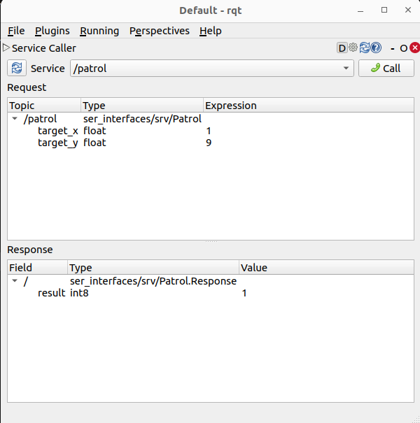  
C++客户端代码实现  
实现步骤：  
1.创建客户端和定时器  
2.定时产生目标点并请求服务端巡逻  
```C++
#include "rclcpp/rclcpp.hpp"
#include "ser_interfaces/srv/patrol.hpp"
#include <chrono>
#include <ctime> // 产生随机数
using Patrol = ser_interfaces::srv::Patrol;
using namespace std::chrono_literals;  // 使用10s 100ms 表示时间

class PatrolClient : public rclcpp::Node{
public:
    PatrolClient() : Node("turtle_controller"){
        patrol_client_ = this->create_client<Patrol>("patrol");
        timer_ = this->create_wall_timer(5s, [&]() -> void{
            // 1.检测服务端是否上线
            while(!this->patrol_client_->wait_for_service(1s)){
                if(!rclcpp::ok()){
                    RCLCPP_ERROR(this->get_logger(), "等待服务上线过程中，rclcpp挂了，我退下了");
                    return;
                }
                RCLCPP_INFO(this->get_logger(), "等待服务上线中......");
                // 在这里初始化一下随机数种子
                srand(time(NULL));
            }
            // 2.构造请求对象
            auto request = std::make_shared<Patrol::Request>();
            // 需要产生随机数
            request->target_x = rand() % 15;
            request->target_y = rand() % 15;
            RCLCPP_INFO(this->get_logger(), "已准备好目标点%f, %f", request->target_x, request->target_y);
            // 3.发送请求
            // 异步发送
            this->patrol_client_->async_send_request(request, [&]
            (rclcpp::Client<Patrol>::SharedFuture result_future) -> void{
                auto response = result_future.get();
                if(response->result == Patrol::Response::SUCCESS){
                    RCLCPP_INFO(this->get_logger(), "请求巡逻目标点成功");
                }
                if(response->result == Patrol::Response::FAIL){
                    RCLCPP_INFO(this->get_logger(), "请求巡逻目标点失败");
                }
            });
        });
    }
private:
    // 定时器  需要定时给一个位置 和 请求服务
    rclcpp::TimerBase::SharedPtr timer_;
    // 创建一个客户端
    rclcpp::Client<Patrol>::SharedPtr patrol_client_;
};

int main(int argc, char** argv){
    rclcpp::init(argc, argv);
    auto node = std::make_shared<PatrolClient>();
    rclcpp::spin(node);
    rclcpp::shutdown();
    return 0;
}
```
验证效果：  
```bash
# 打开小海龟模拟器
ros2 run turtlesim turtlesim_node
# 启动服务端
ros2 run demo_cpp_service turtle_control
# 启动客户端
ros2 run demo_cpp_service patrol_client
```
效果展示：  
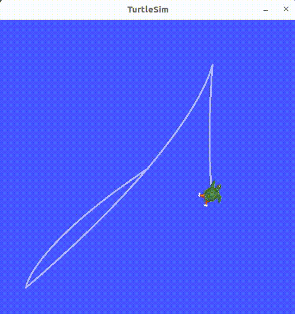  
参数通信  
在Python节点中使用参数，把人脸检测参数改为ROS2参数实现方法  
修改代码如下，使用declare_parameter即可  
```python
self.declare_parameter('number_of_times_to_upsample', 1)
self.declare_parameter('model', 'hog')
self.number_of_times_to_upsample = self.get_parameter\
('number_of_times_to_upsample').value
self.model = self.get_parameter('model').value
```
```bash
ros2 run demo_python_service face_detect_node
ros2 param list
ros2 param set /face_detect_node number_of_times_to_upsample 2
ros2 param get /face_detect_node number_of_times_to_upsample
ros2 param set /face_detect_node model cnn
ros2 param get /face_detect_node model cnn
```
```bash
# 启动节点的时候可以手动设置参数的值
ros2 run demo_python_service face_detect_node --ros-args -p model:=cnn
```
所以参数通信是基于服务通信的  
上述的参数设置只能修改参数一次，需要重新设置的时候就要再次启动节点进行输入，很不方便  
所以引入订阅参数更新 原理相当于服务通信，服务端回调函数，当收到客户端setParam请求时自动调用该回调函数处理  
```python
# 这一行写在构造函数中
self.add_on_set_parameters_callback(self.parameters_callback)

def parameters_callback(self, parameters):
        for parameter in parameters:
            self.get_logger().info(f"{parameter.name}->{parameter.value}")
            if(parameter.name == 'number_of_times_to_upsample'):
                self.number_of_times_to_upsample = parameter.value
            if(parameter.name == 'model'):
                self.model = parameter.value
        return SetParametersResult(success=True)
```
同时客户端节点可以设置服务端节点的参数值，服务端节点也可以自己设置自己的参数值  
C++参数声明与设置  
将巡逻海龟项目服务端中控制器的比例系数k_和最大速度max_speed_进行参数化  
```C++
// 在节点构造函数中添加
// 声明参数 并给出默认值
this->declare_parameter("k", 1.0);
this->declare_parameter("max_speed", 1.0);
// 获取参数 将获取到的参数赋值给k_ max_speed_这两个成员变量
this->get_parameter("k", k_);
this->get_parameter("max_speed", max_speed_);
```
```bash
# 启动节点
ros2 run demo_cpp_service turtle_control
# 查看启动的节点都有什么参数
ros2 param list
```
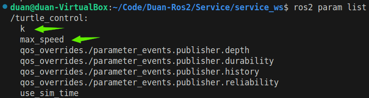  
只更改参数的值，不会实际更改类中成员变量的值，要想修改，就需要有一个接收参数的事件，进而执行回调函数进行更新  
```C++
OnSetParametersCallbackHandle::SharedPtr parameter_callback_;
parameter_callback_ = this->add_on_set_parameters_callback([&](const std::vector<rclcpp::Parameter>& parameters) -> SetParametersResult{
    SetParametersResult result;
    result.successful = true;
    for(const auto& parameter : parameters){
    // 写代码的时候要经常加一些打印日志
        RCLCPP_INFO(this->get_logger(), "更新参数的值%s=%f", parameter.get_name().c_str(), parameter.as_double());
        if(parameter.get_name() == "k"){
            k_ = parameter.as_double();
        }
        if(parameter.get_name() == "max_speed"){
            max_speed_ = parameter.as_double();
        }
    }
    return result;
});
```
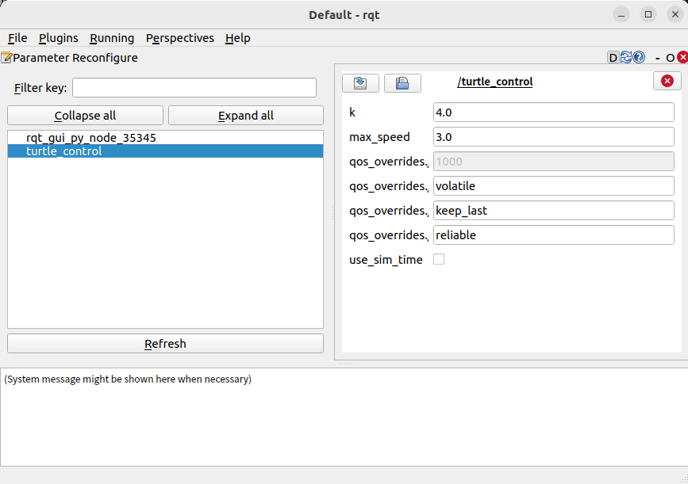
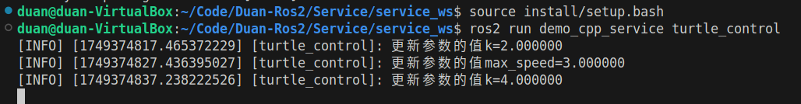  
```C++
// 节点内部自己修改自己的值
this->set_parameter(rclcpp::Parameter("k", 2.0));
```
修改其他节点的参数  
```C++
// 要做到实时修改参数，就需要包括以下几个头文件
// 可以通过ros2 interface show rcl_interfaces/srv/SetParameters查看都需要包括哪些头文件
#include "rcl_interfaces/msg/parameter.hpp"  
#include "rcl_interfaces/msg/parameter_value.hpp"
#include "rcl_interfaces/msg/parameter_type.hpp"
#include "rcl_interfaces/srv/set_parameters.hpp"
```
想通过客户端去修改服务端的参数值，这些是可以复用的代码，以后想修改其他的，加上对应的函数即可  
```C++
/*
    创建客户端发送请求，返回结果
    */
    SetP::Response::SharedPtr call_set_parameters(rcl_interfaces::msg::Parameter &param){
        auto param_client = this->create_client<SetP>("/turtle_control/set_parameters");
        // 1.检测服务端是否上线
        while(!param_client->wait_for_service(1s)){
            if(!rclcpp::ok()){
                RCLCPP_ERROR(this->get_logger(), "等待服务上线过程中，rclcpp挂了，我退下了");
                return nullptr;
            }
            RCLCPP_INFO(this->get_logger(), "等待服务上线中......");
        }
        // 2.构造请求对象
        auto request = std::make_shared<SetP::Request>();
        request->parameters.push_back(param);
        // 3.发送请求
        // 异步发送
        auto future = param_client->async_send_request(request);
        rclcpp::spin_until_future_complete(this->get_node_base_interface(), future);
        auto response = future.get();
        return response;
    }

    /*
    更新参数k
    */
    void update_server_param_k(double k){
        // 1.创建参数对象
        auto param = rcl_interfaces::msg::Parameter();
        param.name = "k";
        // 2.创建参数值
        auto param_value = rcl_interfaces::msg::ParameterValue();
        param_value.type = rcl_interfaces::msg::ParameterType::PARAMETER_DOUBLE;
        param_value.double_value = k;
        param.value = param_value;
        // 3.请求更新参数并处理
        auto response = this->call_set_parameters(param);
        if(response == NULL){
            RCLCPP_INFO(this->get_logger(), "参数更新失败");
            return;
        }
        for(auto result : response->results){
            if(result.successful == false){
                RCLCPP_INFO(this->get_logger(), "参数更新失败：%s", result.reason.c_str());

            }
            else{
                RCLCPP_INFO(this->get_logger(), "参数更新成功");
            }
        }
    }
```
```bash
# 验证
# 启动服务端
ros2 run demo_cpp_service turtle_control
# 启动客户端
ros2 run demo_cpp_service patrol_client
```
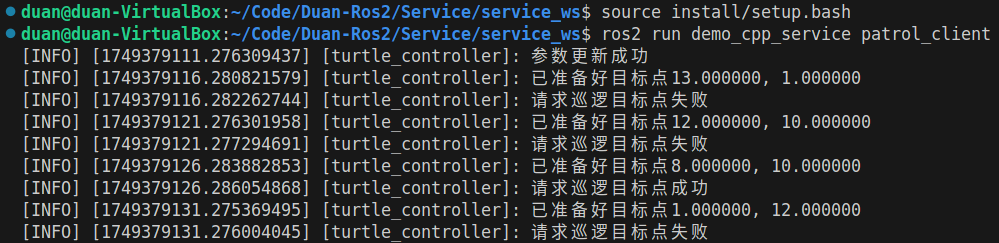
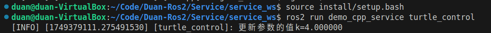  
使用launch启动脚本  
在之前我们启动小海龟模拟器、服务端节点、客户端节点需要打开三个终端分别去启动，也需要分别去关闭，ros2提供了launch来启动多个节点  
ros2提供了三种编写launch文件的方法，分别为Python、XML以及YAML，官方推荐使用Python  
在功能包下面新建一个文件夹 launch 文件夹下的文件以 .launch.py为后缀  
```python
import launch
import launch_ros

def generate_launch_description():
    """产生launch描述"""
    action_node_turtlesim_node = launch_ros.actions.Node(
        package='turtlesim',
        executable='turtlesim_node',
        output='screen'
    )

    action_node_patrol_client = launch_ros.actions.Node(
        package='demo_cpp_service',
        executable='patrol_client',
        output='log'
    )

    action_node_turtle_control = launch_ros.actions.Node(
        package='demo_cpp_service',
        executable='turtle_control',
        output='both'
    )

    return launch.LaunchDescription([
        # actions 动作
        action_node_turtlesim_node,
        action_node_patrol_client,
        action_node_turtle_control,
    ])
# 不要忘记安装在install目录下 还需要再去编写一下CMakeLists
"""
install(DIRECTORY launch
DESTINATION share/${PROJECT_NAME}
)
"""
```
```bash
source install/setup.bash
ros2 launch demo_cpp_service demo.launch.py
```
我们在启动节点的时候可以通过--ros-args去传递参数  
launch中想要传递参数，需要像下面这样去写  
```python
import launch
import launch_ros

def generate_launch_description():
    # 1.声明一个launch参数
    action_declare_arg_background_g = launch.actions.DeclareLaunchArgument\
    ('launch_arg_bg', default_value='150')
    # 2.把launch的参数手动传递给某个节点

    """产生launch描述"""
    action_node_turtlesim_node = launch_ros.actions.Node(
        package='turtlesim',
        executable='turtlesim_node',
        parameters=[{'background_g': launch.substitutions.LaunchConfiguration('launch_arg_bg', default='150')}],
        output='screen'
    )

    action_node_patrol_client = launch_ros.actions.Node(
        package='demo_cpp_service',
        executable='patrol_client',
        output='log'
    )

    action_node_turtle_control = launch_ros.actions.Node(
        package='demo_cpp_service',
        executable='turtle_control',
        output='both'
    )

    return launch.LaunchDescription([
        # actions 动作
        action_declare_arg_background_g,
        action_node_turtlesim_node,
        action_node_patrol_client,
        action_node_turtle_control,
    ])
```
```bash
# --debug可以将日志打印出来 方便以后查找错误
ros2 launch demo_cpp_service demo.launch.py launch_arg_bg:=0 --debug
```
launch使用进阶  
Launch三大组件：动作、条件和替换  
动作：除了是一个节点外，还可以是一句打印，一句终端指令，甚至可以是另一个launch文件  
替换：使用launch的参数替换节点的参数值  
条件：利用条件可以决定哪些动作启动，哪些不启动，相当于if  
```bash
ros2 launch actions.launch.py
```
```python
import launch
import launch.launch_description_sources
import launch_ros
from ament_index_python.packages import get_package_share_directory

def generate_launch_description():
    action_declare_startup_rqt = launch.actions.DeclareLaunchArgument\
    ('startup_rqt', default_value='False')
    startup_rqt = launch.substitutions.LaunchConfiguration('startup_rqt', default='False')
    # 动作1-启动其他launch
    multisim_launch_path = [get_package_share_directory('turtlesim'),'/launch/','multisim.launch.py']
    action_include_launch = launch.actions.IncludeLaunchDescription(
        launch.launch_description_sources.PythonLaunchDescriptionSource(
            multisim_launch_path
        )
    )

    # 动作2-打印数据
    action_log_info = launch.actions.LogInfo(msg=str(multisim_launch_path))

    # 动作3-执行进程，其实就是执行一个命令行 ros2 run topic list
    action_topic_list = launch.actions.ExecuteProcess(
        # cmd=['ros2', 'topci', 'list'],
        # output='screen',
        condition=launch.conditions.IfCondition(startup_rqt),
        cmd=['rqt'],
    )

    # 动作4-组织动作成组，把多个动作放到一组
    action_group = launch.actions.GroupAction([
        # 动作5-定时器
        launch.actions.TimerAction(period=2.0, actions=[action_include_launch]),
        launch.actions.TimerAction(period=4.0, actions=[action_topic_list])
    ])

    return launch.LaunchDescription([
        # actions 动作
        action_log_info,
        action_group,
    ])
```
# 工具介绍
坐标变化工具介绍  
通过命令行使用TF  
```bash
# 发布base_link到base_laser之间的变换
ros2 run tf2_ros static_transform_publisher --x 0.1 --y 0.0 --z 0.2 --roll 0.0 --pitch 0.0 --yaw 0.0 --frame-id base_link --child-frame-id base_laser
# 发布base_laser到wall_point之间的变换
ros2 run tf2_ros static_transform_publisher --x 0.3 --y 0.0 --z 0.0 --roll 0.0 --pitch 0.0 --yaw 0.0 --frame-id base_laser --child-frame-id wall_point
# 查询base_link到wall_point之间的关系
ros2 run tf2_ros tf2_echo base_link wall_point
```
3D旋转可视化
安装一下这个工具    
```bash
sudo apt install mrpt-apps
3d-rotation-converter
```
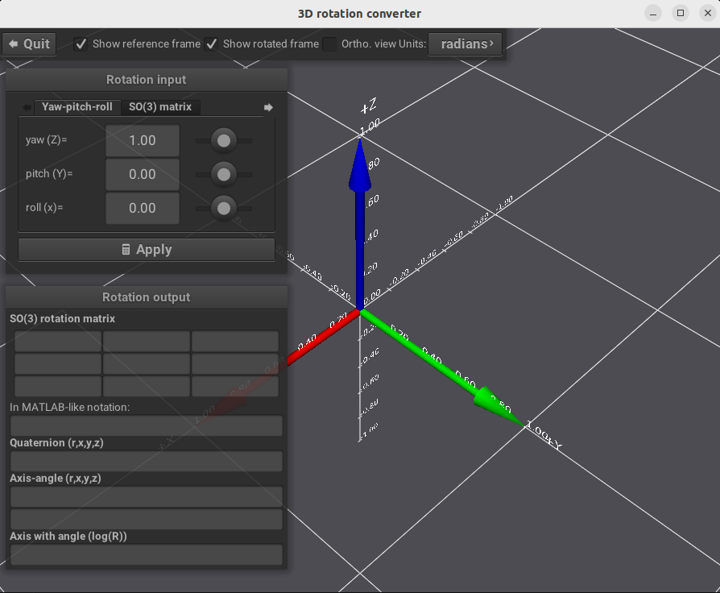  
查看TF树(父子关系)
```bash
ros2 run tf2_tools view_frames
```
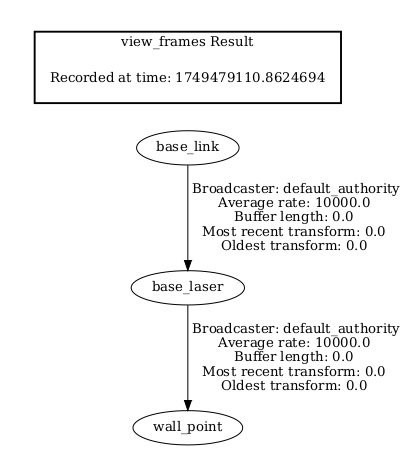  
TF原理的简单探究  
```bash
# 输入
ros2 run tf2_ros static_transform_publisher --x 0.1 --y 0.0 --z 0.2 --roll 0.0 --pitch 0.0 --yaw 0.0 --frame-id base_link --child-frame-id base_laser
ros2 run tf2_ros static_transform_publisher --x 0.3 --y 0.0 --z 0.0 --roll 0.0 --pitch 0.0 --yaw 0.0 --frame-id base_laser --child-frame-id wall_point
ros2 topic list
# 此时就可以看到有 /tf_static 这样一个topic
# 查看topic具体信息
ros2 topic info /tf_static
# 查看消息接口的定义
ros2 interface show tf2_msgs/msg/TFMessage
```
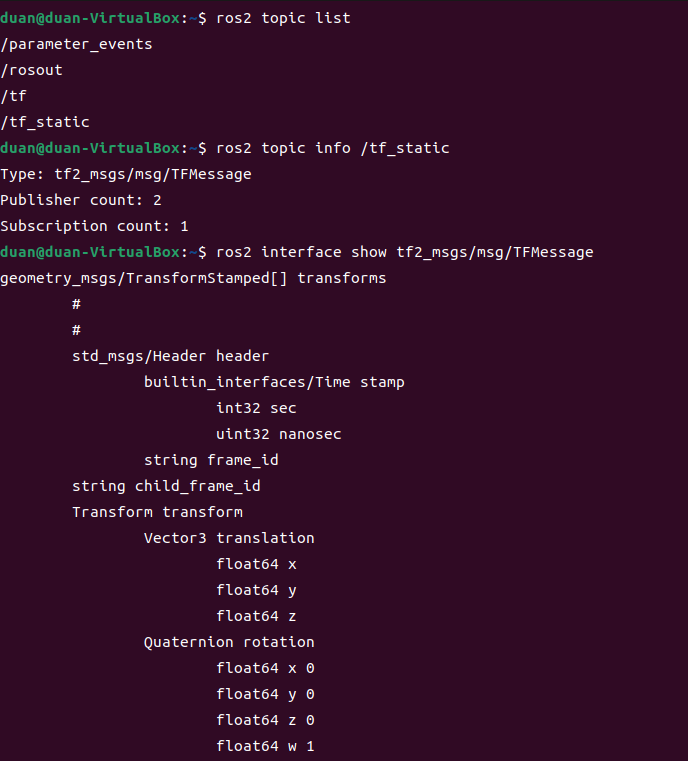  
frame_id是父坐标系的一个名字    child_frame_id是子坐标系的一个名字  
Python中的手眼坐标变换  
需求：  
相机固定在右上方的camera_link处，机械臂的底座固定在base_link处，从base_link到camera_link处的位置是固定不变的，平移分量(0.5, 0.3, 0.6)，旋转；分量(180, 0, 0)  
相机通过识别得到瓶子bottle_link的坐标，其中平移分量(0.2, 0.3, 0.5)，旋转分量(0, 0, 0)  
求bottle_link和base_link的关系  
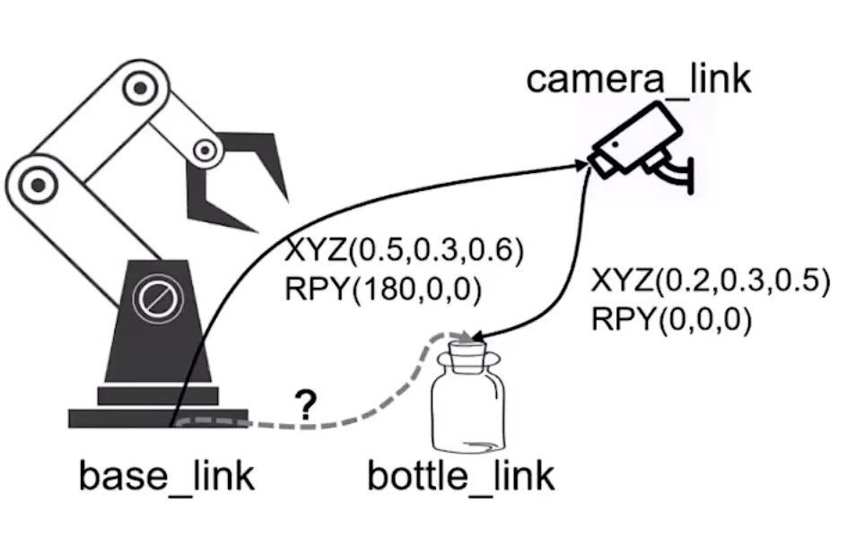  
1.从机械臂底座到相机|静态TF发布  
```bash
# 从欧拉角转为四元素需要安装两个库
# ros2坐标变换工具包 四元素 <-> 欧拉角  互转函数
sudo apt install ros-$ROS_DISTRO-tf-transformations
# python坐标变换库
sudo pip3 install transforms3d
```
```bash
ros2 pkg create  demo_python_tf --build-type ament_python --dependencies rclpy geometry_msgs tf_ros tf_transformations --license Apache-2.0
```
```python
import rclpy
from rclpy.node import Node
from tf2_ros import StaticTransformBroadcaster # 静态坐标发布器 是一个类
from geometry_msgs.msg import TransformStamped # 消息接口
from tf_transformations import quaternion_from_euler # 欧拉角转四元素
import math # 角度转弧度函数

class StaticTFBroadcaster(Node):
    def __init__(self):
        super().__init__('static_tf_broadcaster')
        # 需要通过静态坐标发布器去发布坐标
        self.static_broadcaster_ = StaticTransformBroadcaster(self)
        self.publish_static_tf()

    def publish_static_tf(self):
        """
        发布静态TF 从 base_link到camera_link之间的坐标关系
        """
        transform = TransformStamped()
        transform.header.frame_id = 'base_link'
        transform.child_frame_id = 'camera_link'
        transform.header.stamp = self.get_clock().now().to_msg()
        
        transform.transform.translation.x = 0.5
        transform.transform.translation.y = 0.3
        transform.transform.translation.z = 0.6

        # 欧拉角转为四元素
        # 先转为弧度 再转为四元素
        # q为数组  q = x y z w
        q = quaternion_from_euler(math.radians(180), 0, 0)
        # 旋转部分进行赋值
        transform.transform.rotation.x = q[0]
        transform.transform.rotation.y = q[1]
        transform.transform.rotation.z = q[2]
        transform.transform.rotation.w = q[3]

        # 将静态坐标关系发布出去
        self.static_broadcaster_.sendTransform(transform)
        self.get_logger().info(f'发布静态TF:{transform}')

def main():
    rclpy.init()
    node = StaticTFBroadcaster()
    rclpy.spin(node)
    rclpy.shutdown()
```
```bash
# 订阅一下静态发布的topic
ros2 topic echo /tf_static
# 输出一下base_link 到 camera_link的关系
ros2 run tf2_ros tf2_echo base_link base_camera
```
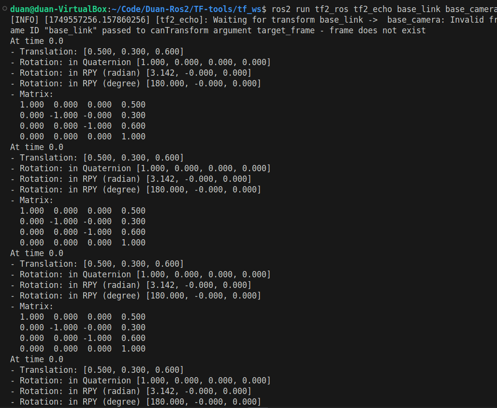  
通过Python发布动态TF  
```python
import rclpy
from rclpy.node import Node
from tf2_ros import TransformBroadcaster # 静态坐标发布器 是一个类
from geometry_msgs.msg import TransformStamped # 消息接口
from tf_transformations import quaternion_from_euler # 欧拉角转四元素

class DynamicTFBroadcaster(Node):
    def __init__(self):
        super().__init__('dynamic_tf_broadcaster')
        # 需要通过静态坐标发布器去发布坐标
        self.dynamic_broadcaster_ = TransformBroadcaster(self)
        # 1秒发送100次
        self.timer_ = self.create_timer(0.01, self.publish_dynamic_tf)

    def publish_dynamic_tf(self):
        """
        发布动态TF 从 camera_link到bottle_link之间的坐标关系
        """
        transform = TransformStamped()
        transform.header.frame_id = 'camera_link'
        transform.child_frame_id = 'bottle_link'
        transform.header.stamp = self.get_clock().now().to_msg()
        
        transform.transform.translation.x = 0.2
        transform.transform.translation.y = 0.3
        transform.transform.translation.z = 0.5

        # 欧拉角转为四元素
        # 先转为弧度 再转为四元素
        # q为数组  q = x y z w
        q = quaternion_from_euler(0, 0, 0)
        # 旋转部分进行赋值
        transform.transform.rotation.x = q[0]
        transform.transform.rotation.y = q[1]
        transform.transform.rotation.z = q[2]
        transform.transform.rotation.w = q[3]

        # 将静态坐标关系发布出去
        self.dynamic_broadcaster_.sendTransform(transform)
        self.get_logger().info(f'发布动态TF:{transform}')

def main():
    rclpy.init()
    node = DynamicTFBroadcaster()
    rclpy.spin(node)
    rclpy.shutdown()
```
```bash
ros2 run demo_python_tf dynamic_tf_broadcaster
# 查看动态tf频率
ros2 topic hz /tf
# 查看camera_link bottle_link的关系
ros2 run tf2_ros tf2_echo camera_link bottle_link
```
Python查询TF关系  
```python
import rclpy
from rclpy.node import Node
import rclpy.time
from tf2_ros import TransformListener, Buffer # 坐标监听器
from tf_transformations import euler_from_quaternion # 四元素转欧拉角
import math # 角度转弧度

class DynamicTFBroadcaster(Node):
    def __init__(self):
        super().__init__('tf_listener')
        self.buffer_ = Buffer()
        self.listener_ = TransformListener(self.buffer_, self)
        self.timer_ = self.create_timer(1.0, self.get_transform)

    def get_transform(self):
        """
        实时查询坐标关系
        """
        try:
            result = self.buffer_.lookup_transform('base_link', 'bottle_link', 
                    rclpy.time.Time(seconds=0), rclpy.time.Duration(seconds=1.0))
            transform = result.transform
            self.get_logger().info(f'平移:{transform.translation}')
            self.get_logger().info(f'旋转:{transform.rotation}')
            rotation_euler = euler_from_quaternion([
                transform.rotation.x,
                transform.rotation.y,
                transform.rotation.z,
                transform.rotation.w]
            )
            self.get_logger().info(f'旋转RPY:{rotation_euler}')
            
        except Exception as e:
            self.get_logger().warn(f'获取坐标变换失败:原因{str(e)}')

def main():
    rclpy.init()
    node = DynamicTFBroadcaster()
    rclpy.spin(node)
    rclpy.shutdown()
```
```bash
# 依次开启
ros2 run demo_python_tf static_tf_broadcaster
ros2 run demo_python_tf dynamic_tf_broadcaster
ros2 run demo_python_tf tf_listener
```
接下来是C++版本  
常见可视化工具rqt与RViz  
```bash
# 安装插件
sudo apt install ros-$ROS_DISTRO-rqt-tf-tree -y
# 更新配置文件
rm -rf ~/.config/ros.org/rqt_gui.ini
```
数据可视化工具RViz  
```bash
rviz2
```
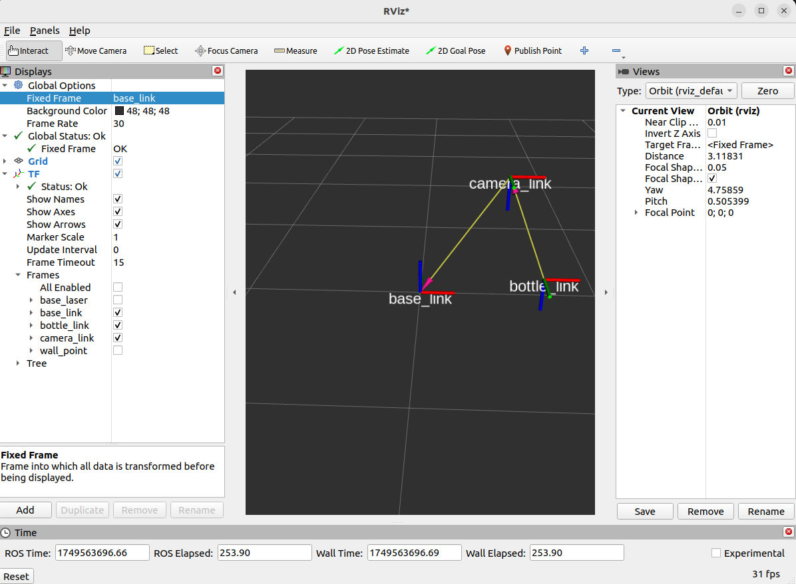  
数据记录工具ros2 bag  
将话题上的数据记录并保存下来，需要的时候播放数据然后进行数据的分析  
```bash
# 常用操作
# 记录
ros2 bag record /turtle1/cmd_vel
# 播放
ros2 bag play rosbag2_xxx
# 打开小海龟模拟器  
ros2 run turtlesim turtlesim_node
ros2 topic list
# 通过键盘控制小海龟
# 这个节点会发布一个topic /turtle1/cmd_vel
# 小海龟节点会订阅这个topic  
ros2 run turtlesim turtle_teleop_key
# 记录这个topic  
ros2 bag record /turtle1/cmd_vel
```
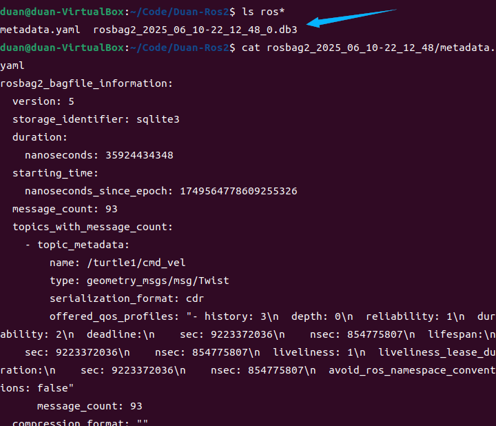  
```bash
# 播包
ros2 bag play rosbag2_2025_06_10-22_12_48/
# 小海龟会像上次一样行动
```
```bash
sudo apt install liburdfdom-tools
```
# 仿真
将算法和程序部署到真正的机器人之前，往往先会采用仿真的机器人进行验证，在此之前需要先对机器人进行建模  
移动机器人结构  
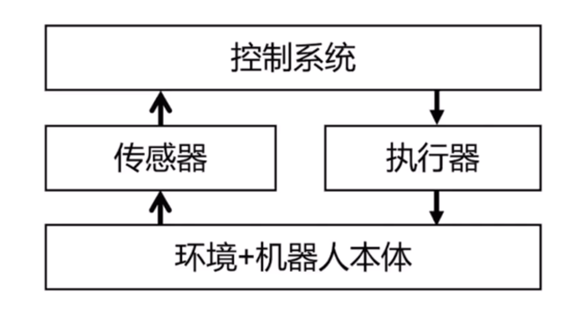  
使用URDF创建机器人  
URDF使用XML(Extensible Markup Language，可扩展标记语言)来描述机器人的几何结构、传感器和执行器等信息  
```urdf
<?xml version="1.0"?>
<robot name="first_robot">
    <!-- 机器人的身体部分 -->
    <link name="base_link">
        <!-- 部件的外观描述 -->
        <visual>
            <!-- 沿着自己几何中心的偏移和旋转 -->
            <origin xyz="0.0 0.0 0.0" rpy="0.0 0.0 0.0"/>
            <!-- 几何形状 -->
            <geometry>
                <!-- 圆柱体 radius 半径 0.10m  高度 0.12m-->
                <cylinder radius="0.10" length="0.12"/>
            </geometry>
            <!-- 材质颜色 -->
            <material name="white">
                <color rgba="1.0 1.0 1.0 0.5"/>
            </material>
        </visual>
    </link>

    <!-- 机器人的IMU部件，惯性测量传感器 -->
    <link name="imu_link">
        <!-- 部件的外观描述 -->
        <visual>
            <!-- 沿着自己几何中心的偏移和旋转 -->
            <origin xyz="0.0 0.0 0.0" rpy="0.0 0.0 0.0"/>
            <!-- 几何形状 -->
            <geometry>
                <!-- 圆柱体 radius 半径 0.10m  高度 0.12m-->
                <box size="0.02 0.02 0.02"/>
            </geometry>
            <!-- 材质颜色 -->
            <material name="black">
                <color rgba="0.0 0.0 0.0 0.5"/>
            </material>
        </visual>
    </link>

    <!-- 机器人的关节，用于组合机器人的部件 -->
    <joint name="imu_joint" type="fixed">
        <parent link="base_link"/>
        <child link="imu_link"/>
        <origin xyz="0.0 0.0 0.03" rpy="0.0 0.0 0.0"/>
    </joint>
</robot>
```
```bash
urdf_to_graphviz first_robot.urdf
```
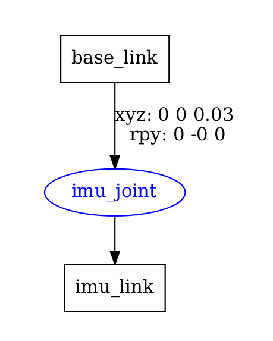  
在RViz中显示机器人  
```bash
# 安装两个节点
sudo apt install ros-$ROS_DISTRO-joint-state-publisher
sudo apt install ros-$ROS_DISTRO-robot-state-publisher
```
```bash
ros2 launch display_robot.launch.py --debug
```
使用Xacro简化URDF  
Xacro是基于XML的宏语言，用于简化URDF文件的创建和维护，使用它可以将部件等定义为宏，在需要使用的时候进行调用即可  
```xacro
<?xml version="1.0"?>
<robot xmlns:xacro="http://www.ros.org/wiki/xacro" name="first_robot">
    <xacro:macro name="base_link" params="length radius">
        <link name="base_link">
            <!-- 部件的外观描述 -->
            <visual>
                <!-- 沿着自己几何中心的偏移和旋转 -->
                <origin xyz="0.0 0.0 0.0" rpy="0.0 0.0 0.0"/>
                <!-- 几何形状 -->
                <geometry>
                    <!-- 圆柱体 radius 半径 0.10m  高度 0.12m-->
                    <cylinder radius="${radius}" length="${length}"/>
                </geometry>
                <!-- 材质颜色 -->
                <material name="white">
                    <color rgba="1.0 1.0 1.0 0.5"/>
                </material>
            </visual>
        </link>
    </xacro:macro>
    <!-- 机器人的身体部分 -->
    
    <xacro:macro name="imu_link" params="imu_name xyz">
        <!-- 机器人的IMU部件，惯性测量传感器 -->
        <link name="${imu_name}_link">
            <!-- 部件的外观描述 -->
            <visual>
                <!-- 沿着自己几何中心的偏移和旋转 -->
                <origin xyz="0.0 0.0 0.0" rpy="0.0 0.0 0.0"/>
                <!-- 几何形状 -->
                <geometry>
                    <!-- 圆柱体 radius 半径 0.10m  高度 0.12m-->
                    <box size="0.02 0.02 0.02"/>
                </geometry>
                <!-- 材质颜色 -->
                <material name="black">
                    <color rgba="0.0 0.0 0.0 0.5"/>
                </material>
            </visual>
        </link>
        <!-- 机器人的关节，用于组合机器人的部件 -->
        <joint name="${imu_name}_joint" type="fixed">
            <parent link="base_link"/>
            <child link="${imu_name}_link"/>
            <origin xyz="${xyz}" rpy="0.0 0.0 0.0"/>
        </joint>    
    </xacro:macro>

    <xacro:base_link length="0.12" radius="0.1"/>
    <xacro:imu_link imu_name="imu_up" xyz="0.0 0.0 0.03"/>
    <xacro:imu_link imu_name="imu_down" xyz="0.0 0.0 -0.03"/> 

</robot>
```
```bash
# xacro ---> urdf
sudo apt install ros-$ROS_DISTRO-xacro
xacro /home/duan/Code/Duan-Ros2/Simulation/sim_ws/src/duanbot_description/urdf/fisrt_robot.xacro
```
```bash
colcon build
source install/setup.bash
ros2 launch duanbot_description display_robot.launch.py model:=/home/duan/Code/Duan-Ros2/Simulation/sim_ws/src/duanbot_description/urdf/fisrt_robot.xacro
```
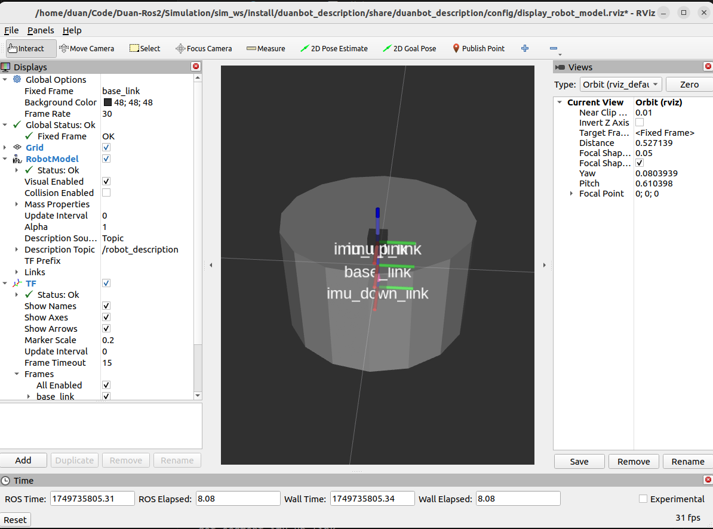  
因此xacro可以通过宏批量生成许多部件  

创建机器人及其传感器部件  
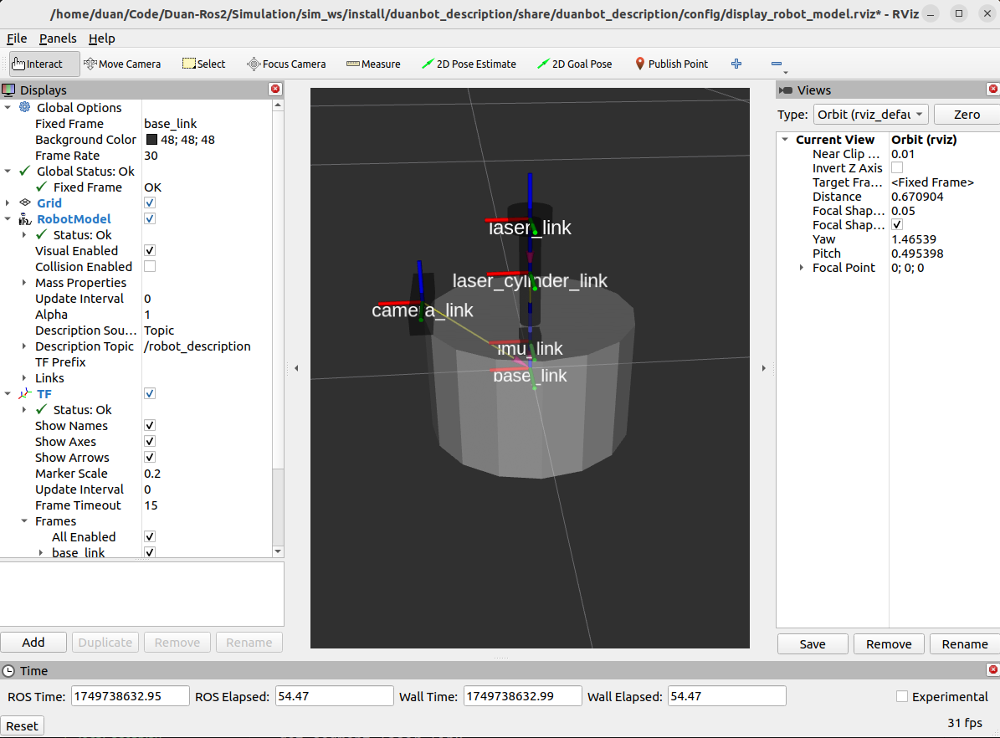  
完善机器人执行部件 执行器主动轮 + 从动轮  
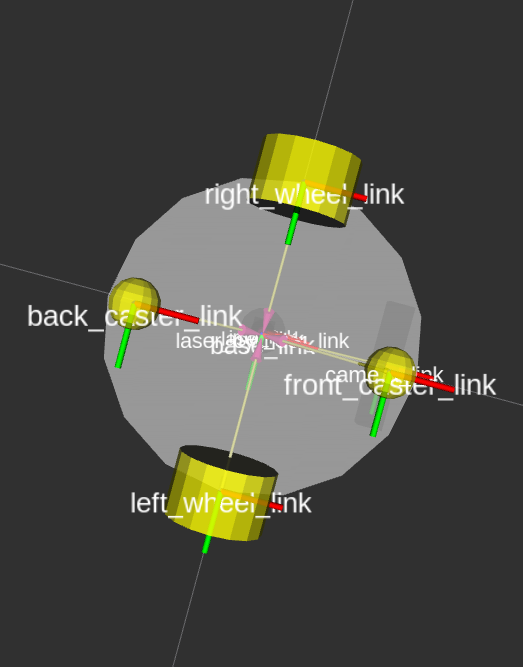  
贴合地面，添加虚拟部件  
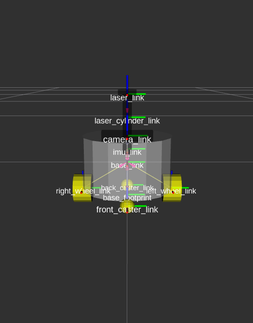  
添加物理属性让机器人更真实  
```xml
<!-- 类似这样，为每一个部件都添加碰撞检测 -->
<collision>
    <!-- 沿着自己几何中心的偏移和旋转 -->
    <origin xyz="0.0 0.0 0.0" rpy="0.0 0.0 0.0"/>
    <!-- 几何形状 -->
    <geometry>
    <!-- 圆柱体 radius 半径 0.10m  高度 0.12m-->
        <cylinder radius="${radius}" length="${length}"/>
    </geometry>
                <!-- 材质颜色 -->
    <material name="white">
        <color rgba="1.0 1.0 1.0 0.5"/>
    </material>
</collision>
```
为机器人部件添加质量与惯性  
真实的机器人部件肯定是有质量的，既然有质量，那么在运动的时候就会有惯性。质量可以直接使用多少千克表示，而旋转惯性则需要使用一个3×3的矩阵表示  
```XML
<?xml version="1.0"?>
<robot xmlns:xacro="http://ros.org/wiki/xacro">
    <xacro:macro name="box_inertia" params="m w h d">
        <inertial>
            <mass value="${m}" />
            <inertia ixx="${(m/12) * (h*h + d*d)}" ixy="0.0" ixz="0.0" iyy="${(m/12) * (w*w + d*d)}" iyz="0.0" izz="${(m/12) * (w*w + h*h)}" />
        </inertial>
    </xacro:macro>

    <xacro:macro name="cylinder_inertia" params="m r h">
        <inertial>
            <mass value="${m}" />
            <inertia ixx="${(m/12) * (3*r*r + h*h)}" ixy="0" ixz="0" iyy="${(m/12) * (3*r*r + h*h)}" iyz="0" izz="${(m/2) * (r*r)}" />
        </inertial>
    </xacro:macro>

    <xacro:macro name="sphere_inertia" params="m r">
        <inertial>
            <mass value="${m}" />
            <inertia ixx="${(2/5) * m * (r*r)}" ixy="0.0" ixz="0.0" iyy="${(2/5) * m * (r*r)}" iyz="0.0" izz="${(2/5) * m * (r*r)}" />
        </inertial>
    </xacro:macro>

</robot>
```
```xml
<!-- 惯性矩阵 -->
<!-- base -->
<xacro:cylinder_inertia m="1.0" r="${radius}" h="${length}" />
<!-- wheel -->
<xacro:cylinder_inertia m="0.05" r="${radius}" h="${length}" />
<!-- caster -->
<xacro:sphere_inertia m="0.05" r="0.016" />
<!-- camera -->
<xacro:box_inertia m="0.1" w="0.02" h="0.10" d="0.02" />
<!-- imu -->
<xacro:box_inertia m="0.05" w="0.02" h="0.02" d="0.02" />
<!-- laser -->
<xacro:cylinder_inertia m="0.05" r="0.01" h="0.10" />
<xacro:cylinder_inertia m="0.10" r="0.02" h="0.02" />
```
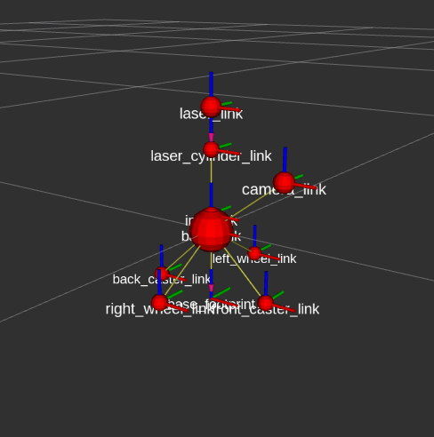  
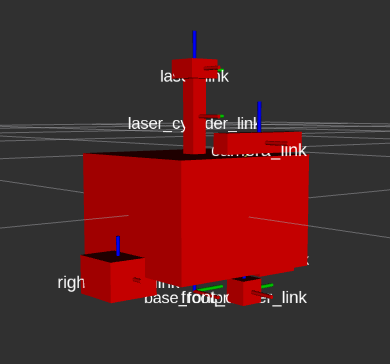  
在Gazebo中完成机器人仿真  
安装与使用Gazebo构建世界  
```bash
sudo apt install gazebo
mkdir -p ~/.gazebo
cd ~/.gazebo
git clone https://gitee.com/ohhuo/gazebo_models.git
~/.gazebo/models
rm -rf ~/.gazebo/models/.git
```
Gazebo使用的是sdf格式，而我们的机器人建模使用的是URDF,所以要想在Gazebo中显示机器人模型，就需要将URDF转换成sdf。不用操心如何转换，因为ROS2提供了
一些功能包，可以帮助我们直接实现这一转换。  
```bash
sudo apt install ros-$ROS_DISTRO-gazebo-ros-pkgs
```
```bash
# 启动launch的同时 加载gazebo
ros2 launch duanbot_description gazebo_sim.launch.py
```
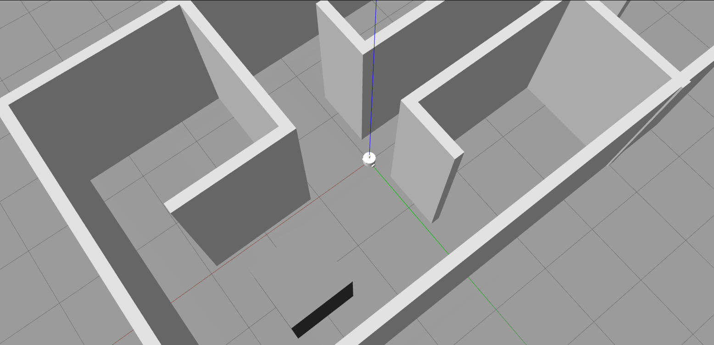  
使用gazebo标签扩展urdf  
```xml
<gazebo reference="${wheel_name}_link">
    <!-- 主要摩擦力 与地面的摩擦式 -->
    <mu1 value="20.0"/>
    <!-- 次要摩擦力 侧向滑动 -->
    <mu2 value="20.0"/>
    <!-- 接触刚度 -->
    <kp value="1000000000.0"/>
    <!-- 接触阻尼 类似于减震器 -->
    <kd value="1.0"/>
</gazebo>

<!-- 设置颜色 -->
<gazebo reference="laser_link">
    <material>Gazebo/Black</material>
</gazebo> 
```
使用两轮差速插件控制机器人  
```xml
<?xml version="1.0"?>
<robot xmlns:xacro="http://www.ros.org/wiki/xacro">
    <xacro:macro name="gazebo_control_plugin">
        <gazebo>
            <!-- 加载Gazebo的ROS2 差速驱动插件 -->
            <!-- 这个插件负责将 ROS 2 的速度指令转换为轮子的运动，并计算里程计 -->
            <plugin name='diff_drive' filename='libgazebo_ros_diff_drive.so'>
                <ros>
                    <namespace>/</namespace>
                    <remapping>cmd_vel:=cmd_vel</remapping>
                    <remapping>odom:=odom</remapping>
                </ros>
                <update_rate>30</update_rate>
                <!-- wheels -->
                <!-- 指定左右轮的关节名称（需与 URDF 中定义的一致）-->
                <left_joint>left_wheel_joint</left_joint>
                <right_joint>right_wheel_joint</right_joint>
                <!-- kinematics -->
                <wheel_separation>0.2</wheel_separation>
                <wheel_diameter>0.064</wheel_diameter>
                <!-- limits -->
                <max_wheel_torque>20</max_wheel_torque>
                <max_wheel_acceleration>1.0</max_wheel_acceleration>
                <!-- output -->
                <!-- 里程计发布配置 -->
                <publish_odom>true</publish_odom>
                <publish_odom_tf>true</publish_odom_tf>
                <publish_wheel_tf>true</publish_wheel_tf>

                <odometry_frame>odom</odometry_frame>
                <robot_base_frame>base_footprint</robot_base_frame>
            </plugin>
        </gazebo>
   </xacro:macro>
</robot>
```
```python
# launch文件
import launch
import launch.launch_description_sources
import launch_ros # ros2启动系统的核心模块
from ament_index_python.packages import get_package_share_directory # 获取功能包的安装路径 安装是通过CMakeLists
import os

import launch_ros.parameter_descriptions # 用于处理参数值的特殊类型

def generate_launch_description():
    # 获取功能包share路径
    urdf_package_path = get_package_share_directory('duanbot_description')
    # 机器人模型文件
    default_xacro_path = os.path.join(urdf_package_path, 'urdf', 'duanbot/duanbot.urdf.xacro')
    # default_rviz_config_path = os.path.join(urdf_package_path, 'config', 'display_robot_model.rviz')
    # 仿真世界文件
    default_gazebo_world_path = os.path.join(urdf_package_path, 'world', 'custom_room.world')
    # 声明一个urdf目录的参数 方便修改
    action_declare_arg_mode_path = launch.actions.DeclareLaunchArgument(
        name='model', default_value=str(default_xacro_path), description='加载的模型文件路径'
    )

    # 通过文件路径获取内容并转换为参数值对象，以供传入 robot_state_publisher
    substitutions_command_result = launch.substitutions.Command(['xacro ', launch.substitutions.LaunchConfiguration('model')])
    robot_description_value = launch_ros.parameter_descriptions.ParameterValue(substitutions_command_result, value_type=str)

    # 可视化和控制机器人
    """
    1.从 robot_description 参数获取完整的 URDF 模型
    2.监听 /joint_states 话题（由关节控制器或模拟器发布）
    3.根据接收到的关节位置（如 shoulder_pan_joint=0.5 弧度）
    4.计算所有连杆和关节的位置和姿态
    5.通过 /tf 和 /tf_static 话题发布 TF 变换树
    """
    action_robot_state_publisher = launch_ros.actions.Node(
        package='robot_state_publisher',
        executable='robot_state_publisher',
        parameters=[{'robot_description':robot_description_value}]
    )

    # 启动gazebo
    action_launch_gazebo = launch.actions.IncludeLaunchDescription(
        launch.launch_description_sources.PythonLaunchDescriptionSource(
            [get_package_share_directory('gazebo_ros'),'/launch','/gazebo.launch.py']
        ),
        launch_arguments=[('world', default_gazebo_world_path),('verbose','true')]
    )

    # 加载机器人到gazebo
    action_spawn_entity = launch_ros.actions.Node(
        package='gazebo_ros',
        executable='spawn_entity.py',
        arguments=['-topic','/robot_description','-entity','duanbot']
    )

    return launch.LaunchDescription([
        action_declare_arg_mode_path,
        action_robot_state_publisher,
        action_launch_gazebo,
        action_spawn_entity
    ])
```
两轮差速插件工作流程：  
1.接收速度指令：订阅 /cmd_vel 话题（类型：geometry_msgs/Twist）  
2.运动学转换：将线速度和角速度转换为左右轮的转速  
3.物理模拟：根据轮间距、直径等参数，在 Gazebo 中模拟轮子转动  
4.里程计计算：根据轮子的实际运动，反向推算机器人的位姿  
5.发布数据：  
* 通过 /odom 话题发布里程计消息
* 通过 TF 系统发布 odom → base_footprint 的坐标变换  
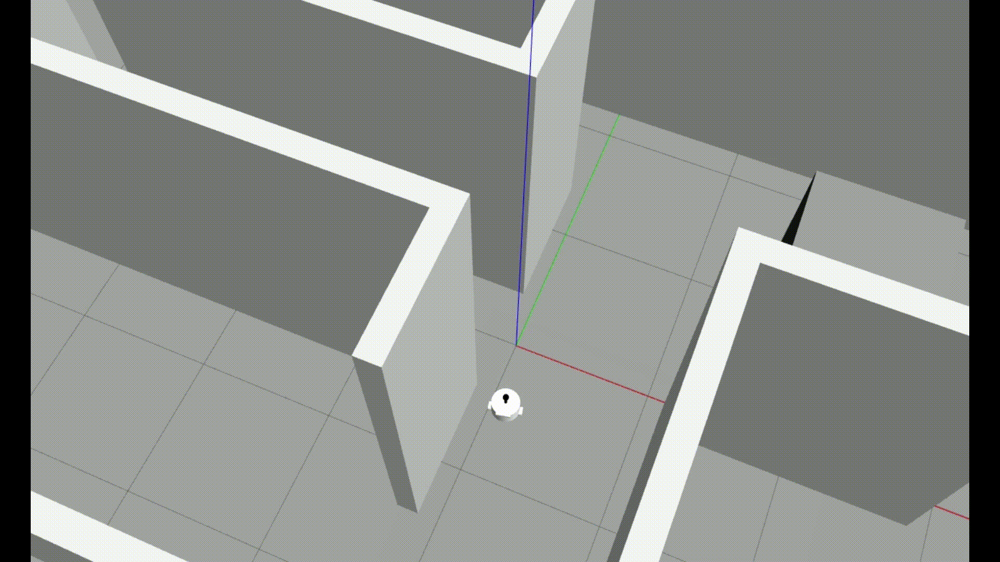  
激光雷达传感器仿真  
```xml
<?xml version="1.0"?>
<robot xmlns:xacro="http://www.ros.org/wiki/xacro">
    <xacro:macro name="gazebo_sensor_plugin">
    <!-- 雷达所对应关节的名字 -->
        <gazebo reference="laser_link">
        <!-- 传感器的名字 可以自己换名字 -->
            <sensor name="laserscan" type="ray">
                <!-- plugin标签 filename是插件名字 -->
                <!-- 会解析下面这个标签的名字 存放在模拟器中 -->
                <!-- 插件本质上也是代码 -->
                <plugin name="laserscan" filename="libgazebo_ros_ray_sensor.so">
                    <ros>
                        <namespace>/</namespace>
                        <remapping>~/out:=scan</remapping>
                    </ros>
                    <output_type>sensor_msgs/LaserScan</output_type>
                    <frame_name>laser_link</frame_name>
                </plugin>
                <always_on>true</always_on>
                <visualize>true</visualize>
                <update_rate>5</update_rate>
                <pose>0 0 0 0 0 0</pose>
				<!-- 激光传感器配置 -->
                <ray>
                    <!-- 设置扫描范围 -->
                    <scan>
                        <horizontal>
                            <samples>360</samples>
                            <resolution>1.000000</resolution>
                            <min_angle>0.000000</min_angle>
                            <max_angle>6.280000</max_angle>
                        </horizontal>
                    </scan>
                    <!-- 设置扫描距离 -->
                    <range>
                        <min>0.120000</min>
                        <max>8.0</max>
                        <resolution>0.015000</resolution>
                    </range>
                    <!-- 设置噪声 -->
                    <!-- 目的接近真实的传感器 -->
                    <noise>
                        <type>gaussian</type>
                        <mean>0.0</mean>
                        <stddev>0.01</stddev>
                    </noise>
                </ray>
            </sensor>
        </gazebo>
   </xacro:macro>
</robot>
```
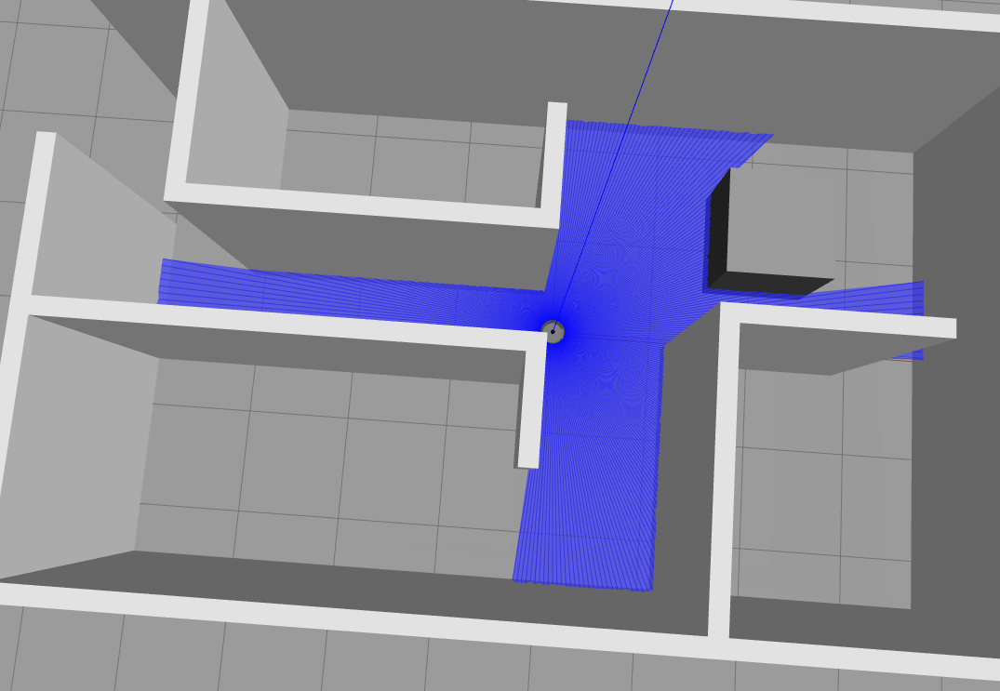  
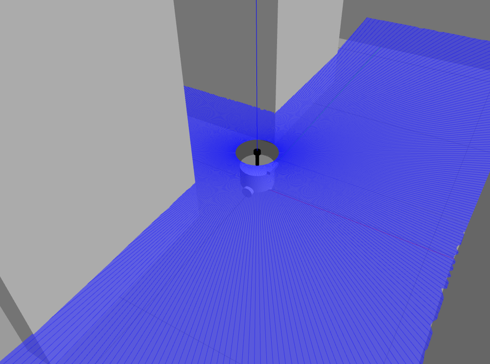  
在rviz中可视化激光雷达数据  
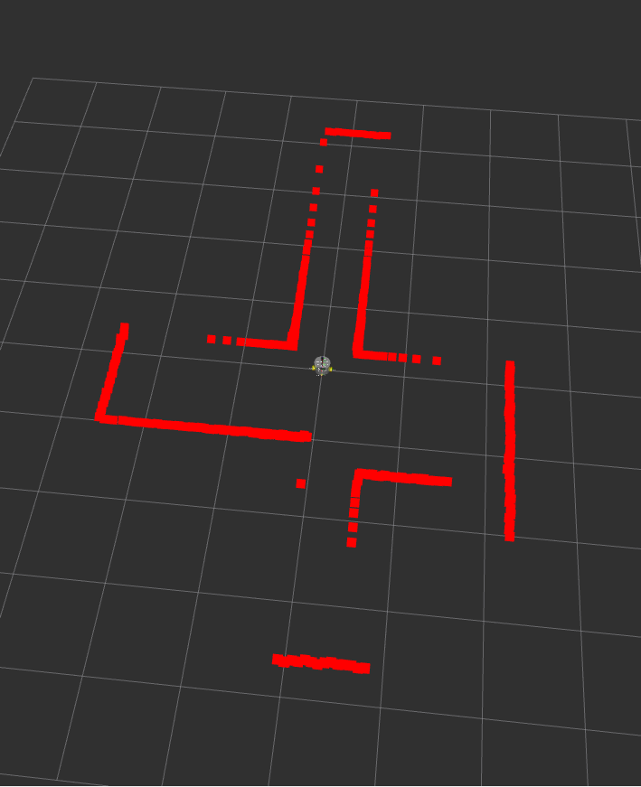  
惯性测量传感器仿真  
深度相机传感器仿真  
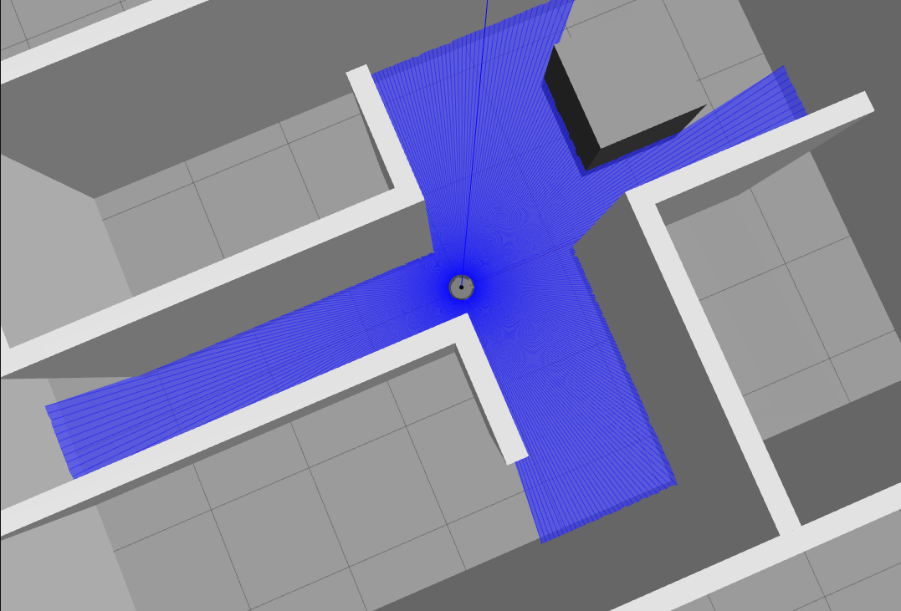  
在rviz中可视化  
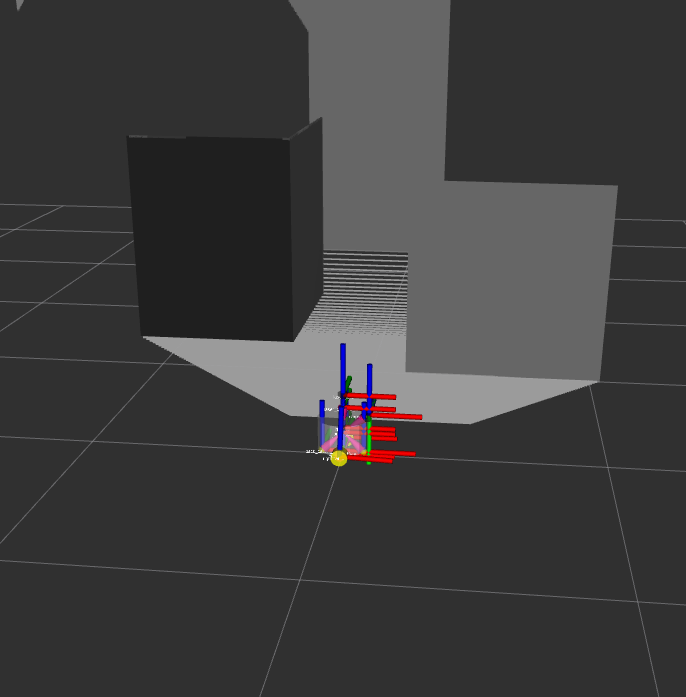  
所有仿真完成后对应的topic列表  
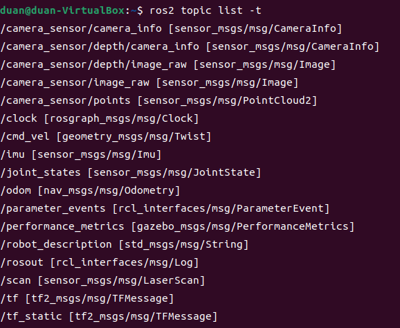  
使用ros2_control驱动机器人  
插件模式架构  
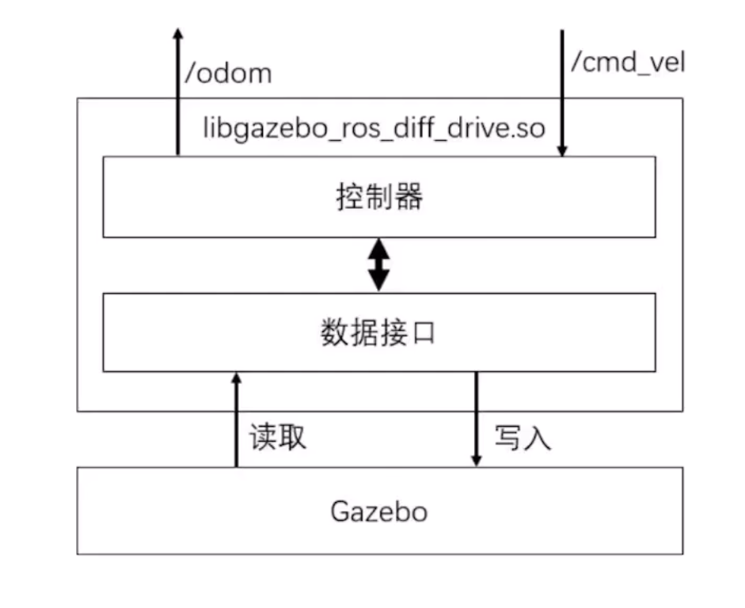  
```bash
sudo apt install ros-$ROS_DISTRO-ros2-control
ros2 control --help
# 能看到帮助列表就算安装成功了
sudo apt info ros-$ROS_DISTRO-ros2-controllers
sudo apt install ros-$ROS_DISTRO-ros2-controllers
# 接下来就能使用这些控制器对机器人进行控制  
```
使用Gazebo接入ros2_control  
Gazebo接入ros2 control,其实就是让Gazebo按照ros2 control指定的接口提供数据。在ROS2中利用相应的Gazebo插件，可以方便的实现Gazebo和ros2_control的对接  
```bash
# 安装Gazebo ROS2 control插件
sudo apt install ros-$ROS_DISTRO-gazebo-ros2-control
```
将仿真的、虚拟的硬件资源导出为状态接口和命令接口，让接口管理器进行管理，之后通过接口加载相关的插件，发送到topic  
```bash
# 列出当前系统中已经注册的所有控制器类型
# 速度控制 力控制等等
ros2 control list_controller_types
# 列出硬件接口
ros2 control list_hardware_interfaces
# 列出硬件组建
ros2 control list_hardware_components
```
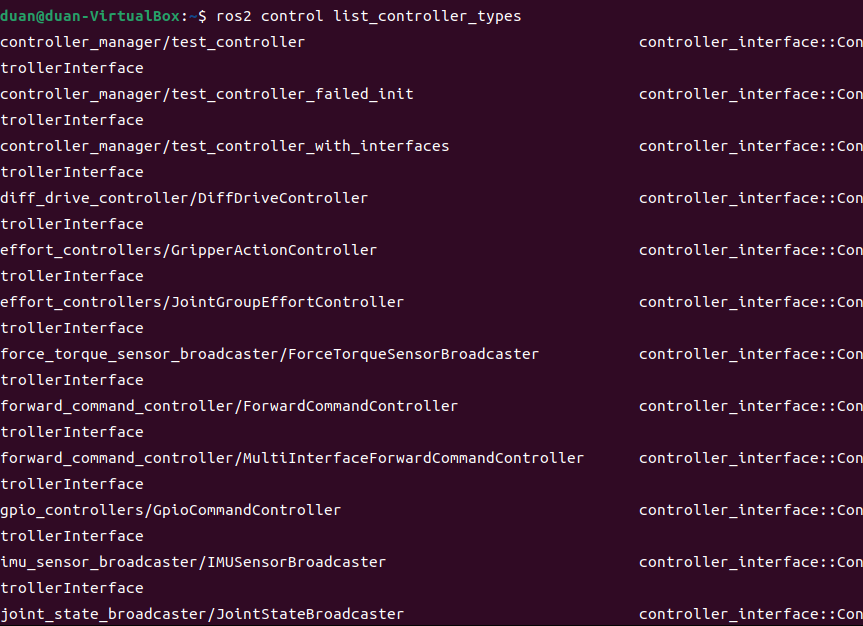  
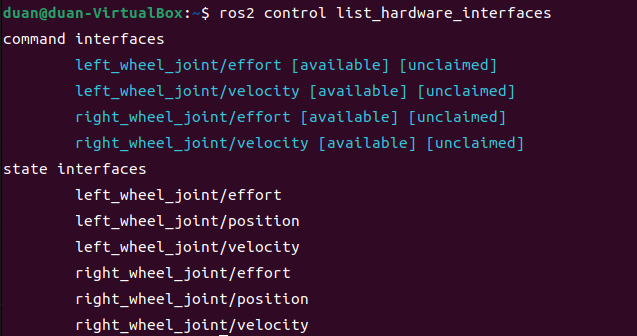  
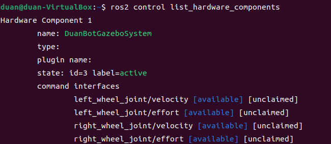  
使用关节状态发布控制器 发布关节的状态  
```bash
ros2 node info /robot_state_publisher
# 可以发现这个节点订阅了/joint_states这个topic
# 所以我们往这个topic发两个轮子的数据，它自然会把两个轮子的tf跟base_link之间的关系发布出去
# joint_state_broadcaster/JointStateBroadcaster 会去发布话题
```
```yaml
controller_manager:
  ros__parameters:
    update_rate: 100  # Hz
    use_sim_time: true

    duan_joint_state_broadcaster:
      type: joint_state_broadcaster/JointStateBroadcaster
```
```bash
# 加载和激活
ros2 control load_controller duanbot_joint_state_broadcaster --set-state active
```
使用力控制器控制轮子  
在duanbot_ros2_controller.yaml中配置完成后，记得在launch文件中启动，注意启动顺序  
```bash
ros2 topic list | grep effort
ros2 topic list -t | grep effort
# 给左轮右轮一个微小的力，看能否动起来
ros2 topic pub /duanbot_effort_controller/commands std_msgs/msg/Float64MultiArray "{data: [0.0001, 0.0001]}"
```
使用两轮差速控制器控制机器人  
状态发布控制器和力控制器只是对状态接口的简单调用，本节我们来学习如何使用两轮差速控制器，这个控制器相对而言要复杂很多，该控制器不仅仅是单纯的数据转发，还涉及到了运动学计算，从而得到里程计信息和两个轮子的目标速度  
通过使用gazebo扩展标签，以及配置文件，生成对应的topic，再通过重映射
```yaml
        duanbot_diff_drive_controller:
            # 控制器类型
            type: diff_drive_controller/DiffDriveController
duanbot_diff_drive_controller:
  ros__parameters:
    left_wheel_names: ["left_wheel_joint"]
    right_wheel_names: ["right_wheel_joint"]

    wheel_separation: 0.20
    #wheels_per_side: 1  # actually 2, but both are controlled by 1 signal
    wheel_radius: 0.032

    wheel_separation_multiplier: 1.0
    left_wheel_radius_multiplier: 1.0
    right_wheel_radius_multiplier: 1.0

    publish_rate: 50.0
    odom_frame_id: odom
    base_frame_id: base_footprint
    pose_covariance_diagonal : [0.001, 0.001, 0.0, 0.0, 0.0, 0.01]
    twist_covariance_diagonal: [0.001, 0.0, 0.0, 0.0, 0.0, 0.01]

    open_loop: true
    enable_odom_tf: true

    cmd_vel_timeout: 0.5
    #publish_limited_velocity: true
    use_stamped_vel: false
    #velocity_rolling_window_size: 10
```
```xml
<ros>
    <remapping>/duanbot_diff_drive_controller/odom:=/odom</remapping>
    <remapping>/duanbot_diff_drive_controller/cmd_vel_unstamped:=/cmd_vel</remapping>
</ros>
```
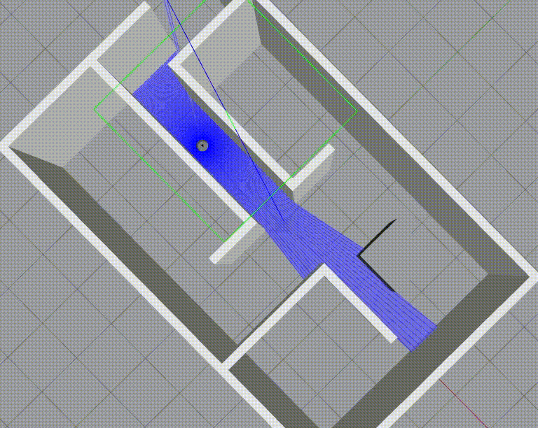  
# 自主导航--让机器人自己动起来
机器人导航介绍：  
原始相机使用slam会有许多问题，比如偏差等等
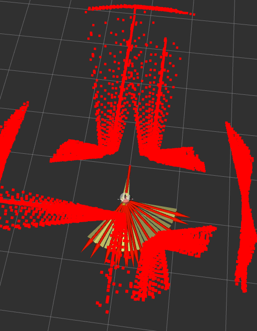  
slam可以分为激光slam和视觉slam  
激光 SLAM 用激光雷达，成本高、抗光性强  
视觉 SLAM 用摄像头，成本低、依赖光照  
激光 SLAM 构建点云地图，定位靠点云匹配，精度高；视觉 SLAM 提取图像特征建图，定位易受动态物体和运动模糊影响  

使用slam_toolbox完成建图  
```bash
# 安装建图工具
sudo apt install ros-$ROS_DISTRO-slam-toolbox
# 在线异步建图
ros2 launch slam_toolbox online_async_launch.py use_sim_time:=True
```
将地图保存为文件  
```bash
sudo apt install ros-$ROS_DISTRO-nav2-map-server
ros2 run nav2_map_server map_saver_cli -f room
```